1. Insert at least 10 sample records into each of the following tables: `Customers`, `Accounts`, `Transactions`, `InterestRates`, `Branches`.

```sql
CREATE TABLE CUSTOMERS (
    customer_id INT Primary Key,
    first_name VARCHAR(100),
    last_name VARCHAR(100),
    DOB DATE,
    email VARCHAR(100),
    phone_number BIGINT,
    address VARCHAR(100)
);
INSERT INTO CUSTOMERS(customer_id, first_name, last_name, DOB, email, phone_number, address)
VALUES
(1, 'John', 'Doe', '1985-07-15', 'john.doe@example.com', 1234567890, '123 Main St'),
(2, 'Jane', 'Smith', '1990-04-22', 'jane.smith@email.com', 9876543210, '456 Oak Ave'),
(3, 'Michael', 'Johnson', '1982-09-10', 'michael.j@example.com', 51234567, '789 Elm Rd'),
(4, 'Emily', 'Brown', '1993-12-03', 'emily.brown@email.com', 77889999, '321 Pine Blvd'),
(5, 'David', 'Lee', '1988-11-20', 'david.lee@example.com', 44456901, '456 Maple Ln'),
(6, 'Sarah', 'Miller', '1992-08-18', 'sarah.miller@email.com', 22234444, '987 Cedar Ave'),
(7, 'Robert', 'Wilson', '1980-05-25', 'robert.wilson@example.com', 2223333, '654 Birch Rd'),
(8, 'Jessica', 'Garcia', '1987-03-08', 'jessica.garcia@email.com', 9987777, '789 Pine St'),
(9, 'Daniel', 'Martinez', '1995-06-12', 'daniel.martinez@example.com', 67778888, '234 Elm Ave'),
(10, 'Amanda', 'Taylor', '1984-02-28', 'amanda.taylor@email.com', 3335555, '876 Oak Rd');
DROP TABLE Customers;
DROP TABLE CUSTOMERS;
SELECT * FROM CUSTOMERS;
```

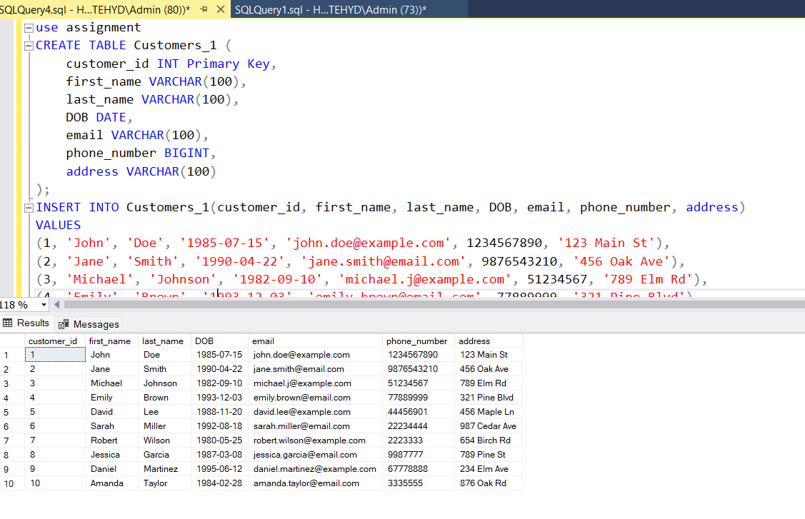

```
CREATE TABLE Accounts (
account_id INT Primary Key,
customer_id INT,
account_type VARCHAR(100), ---(e.g., savings, current, zero_balance)
balance  FLOAT ,
constraint Accounts_CID_FK FOREIGN KEY (customer_id) REFERENCES CUSTOMERS (customer_id) ,
);
INSERT INTO Accounts (account_id, customer_id, account_type, balance)
VALUES
(1, 1, 'Savings', 5000.00),
(2, 2, 'Checking', 2500.50),
(3, 3, 'Investment', 10000.75),
(4, 4, 'Savings', 7500.25),
(5, 5, 'Checking', 300.00),
(6, 6, 'Investment', 15000.00),
(7, 7, 'Savings', 12000.00),
(8, 8, 'Checking', 4500.80),
(9, 9, 'Investment', 8000.50),
(10, 10, 'Savings', 9000.60);
Select * from Accounts;
INSERT INTO Accounts (account_id, customer_id, account_type, balance)
VALUES
(11, 1, 'Investment', 2000.00);
```

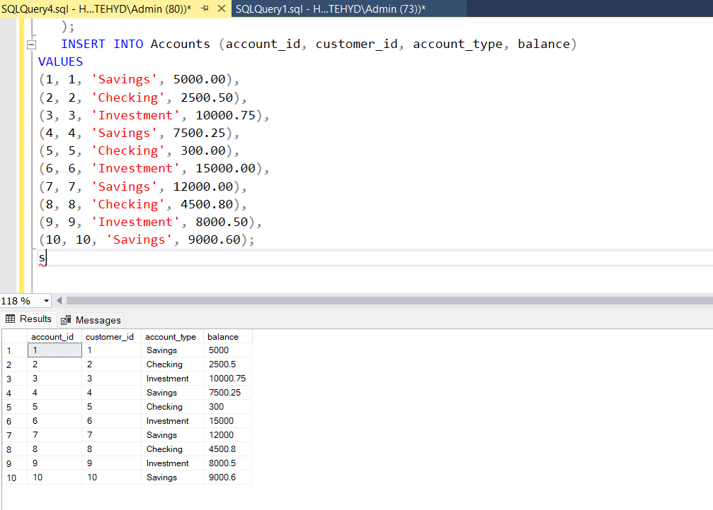

```sql
CREATE TABLE Transactions (
transaction_id INT Primary Key,
account_id INT ,
transaction_type VARCHAR(50), -- (e.g., deposit, withdrawal, transfer)
amount FLOAT,
transaction_date DATE,
constraint Transactions_AID_FK  FOREIGN KEY (account_id ) REFERENCES  Accounts (account_id )
);
INSERT INTO Transactions (transaction_id, account_id, transaction_type, amount, transaction_date)
VALUES
(1, 1, 'deposit', 1000.00, '2024-06-01'),
(2, 2, 'deposit', 500.50, '2024-06-02'),
(3, 3, 'withdrawal', 200.75, '2024-06-03'),
(4, 4, 'deposit', 1500.25, '2024-06-04'),
(5, 5, 'withdrawal', 100.00, '2024-06-05'),
(6, 6, 'deposit', 2000.00, '2024-06-06'),
(7, 7, 'withdrawal', 500.00, '2024-06-07'),
(8, 8, 'transfer', 700.80, '2024-06-08'),
(9, 9, 'deposit', 1200.50, '2024-06-09'),
(10, 10, 'withdrawal', 300.60, '2024-06-10');
INSERT INTO Transactions (transaction_id, account_id, transaction_type, amount, transaction_date)
VALUES
(11, 1, 'deposit', 100.00, '2024-06-01');
INSERT INTO Transactions (transaction_id, account_id, transaction_type, amount, transaction_date)
VALUES
(12, 6, 'deposit', 200.00, '2024-07-01');
INSERT INTO Transactions (transaction_id, account_id, transaction_type, amount, transaction_date)
VALUES
(13, 4, 'withdrawal', 500.00, '2024-08-01');
INSERT INTO Transactions (transaction_id, account_id, transaction_type, amount, transaction_date)
VALUES
(14, 4, 'deposit', 200.00, '2024-07-01');
INSERT INTO Transactions (transaction_id, account_id, transaction_type, amount, transaction_date)
VALUES
(15, 1, 'withdrawal', 500.00, '2024-08-01');
INSERT INTO Transactions (transaction_id, account_id, transaction_type, amount, transaction_date)
VALUES
(16, 7, 'deposit', 200.00, '2024-07-01');
INSERT INTO Transactions (transaction_id, account_id, transaction_type, amount, transaction_date)
VALUES
(17, 2, 'withdrawal', 500.00, '2024-08-01');
Select * from Transactions;
```

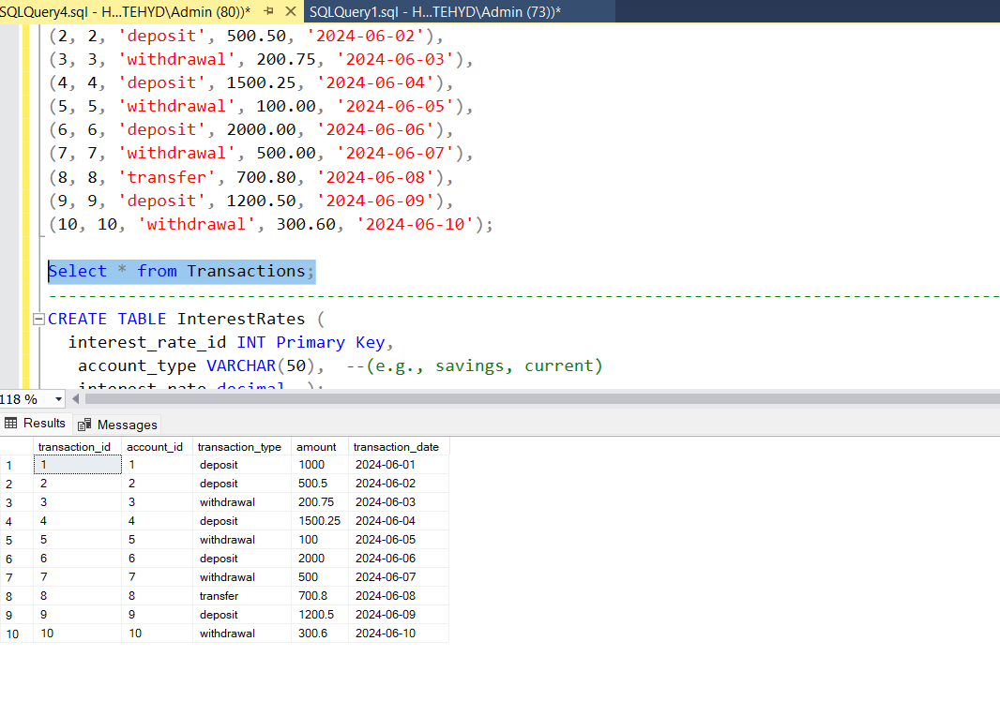

```sql
CREATE TABLE InterestRates (
  interest_rate_id INT Primary Key,
   account_type VARCHAR(50),  --(e.g., savings, current)
   interest_rate decimal  );
   INSERT INTO InterestRates (interest_rate_id, account_type, interest_rate)
VALUES
(1, 'Savings', 0.5),
(2, 'Checking', 0.2),
(3, 'Investment', 1.0);*/
Select * from InterestRates;
```

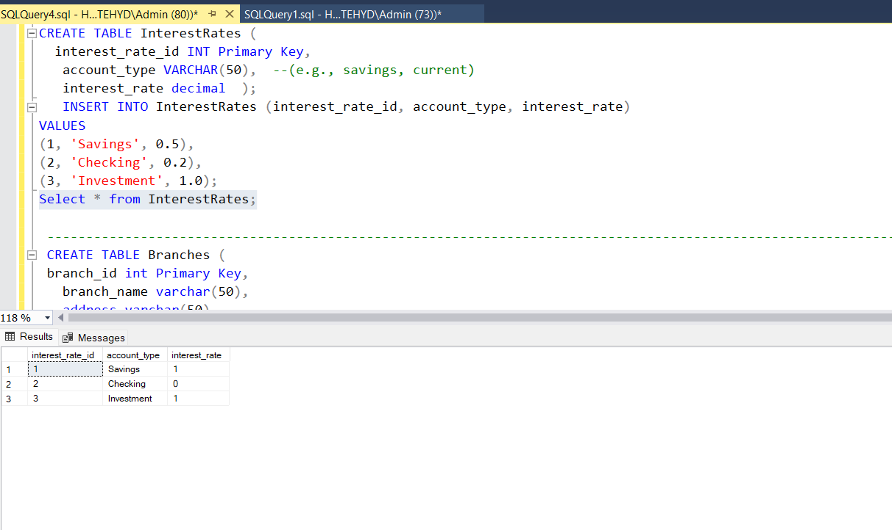

```sql
CREATE TABLE Branches (
 branch_id int Primary Key,
   branch_name varchar(50),
   address varchar(50)
   );
   INSERT INTO Branches (branch_id, branch_name, address)
VALUES
(1, 'Main Street Branch', '123 Main St'),
(2, 'Oak Avenue Branch', '456 Oak Ave'),
(3, 'Elm Road Branch', '789 Elm Rd'),
(4, 'Pine Boulevard Branch', '321 Pine Blvd'),
(5, 'Maple Lane Branch', '456 Maple Ln'),
(6, 'Cedar Avenue Branch', '987 Cedar Ave'),
(7, 'Birch Road Branch', '654 Birch Rd'),
(8, 'Pine Street Branch', '789 Pine St'),
(9, 'Elm Avenue Branch', '234 Elm Ave'),
(10, 'Oak Road Branch', '876 Oak Rd');
Select * from  Branches;
```

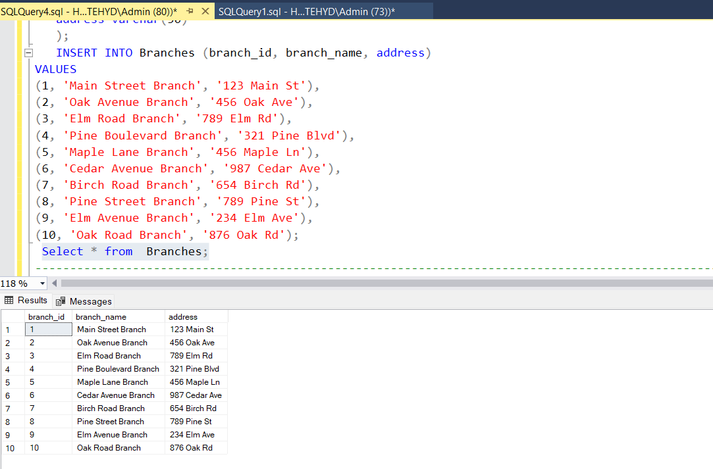

```sql
2. Write a SQL query to retrieve the name, account type, and email of all customers.
Select customer_id, first_name, last_name,CONCAT(first_name , last_name)  as Name from Customers_1
 inner join Accounts on Accounts.customer_id=Customers_1.customer_id;
```

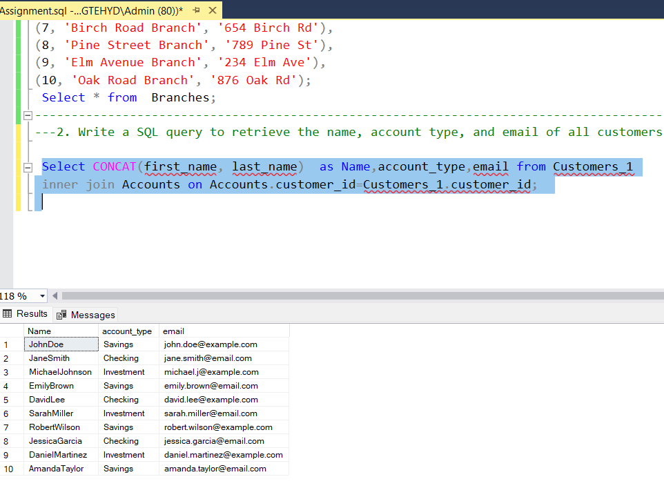

```sql
3. Write a SQL query to list all transactions along with the corresponding customer.
Select T.transaction_id,CONCAT(C.first_name, C.last_name)  as Name from CUSTOMERS C
JOIN ACCOUNTS A ON C.Customer_id = A.Customer_id
JOIN Transactions T ON A.account_id = T.account_id
order by Name;
```

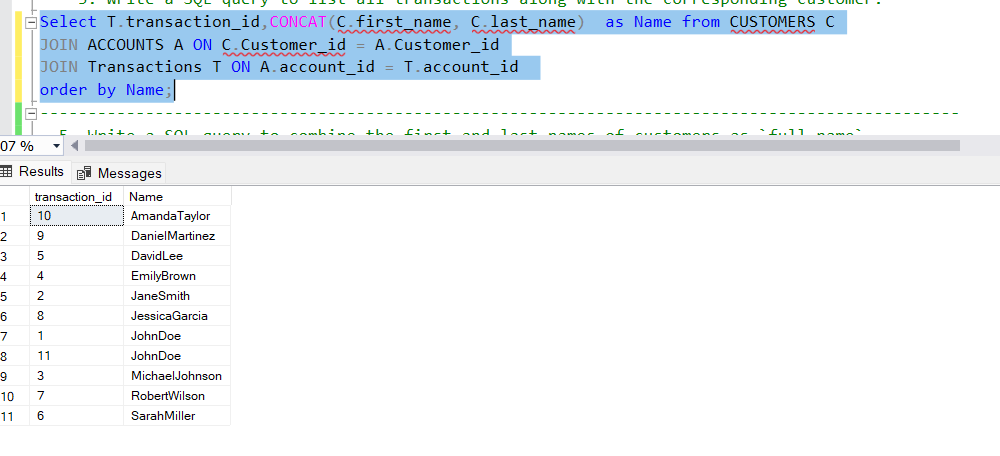

```sql
4. Write a SQL query to increase the balance of a specific account by a certain amount.
Update Accounts set balance = balance + 5000.00
where account_id=4;
Select account_id, balance from Accounts where account_id=4;
```

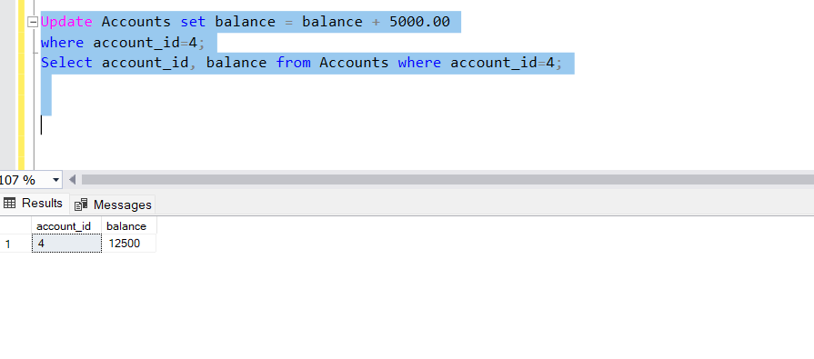

```sql
5. Write a SQL query to combine the first and last names of customers as `full_name`.
Select customer_id, first_name, last_name,CONCAT(first_name , last_name)  as full_name from Customers_1;
```

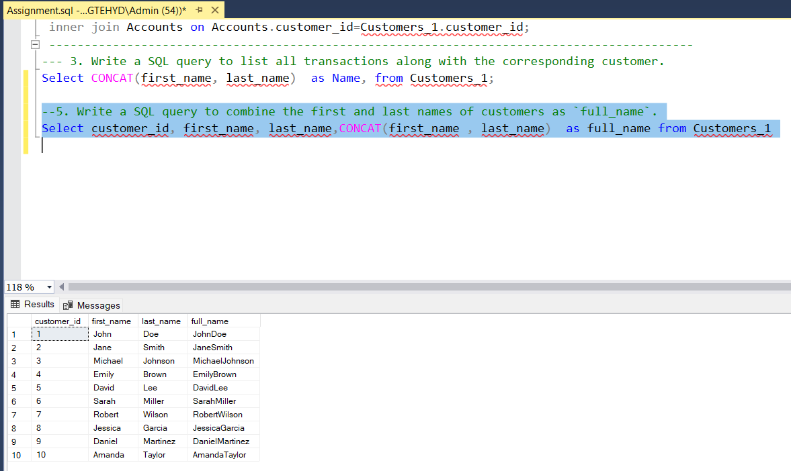

```sql
6. Write a SQL query to remove accounts with a balance of zero where the account type is savings.
Select account_type , Balance from Accounts
where account_type='savings' AND balance='0';
```

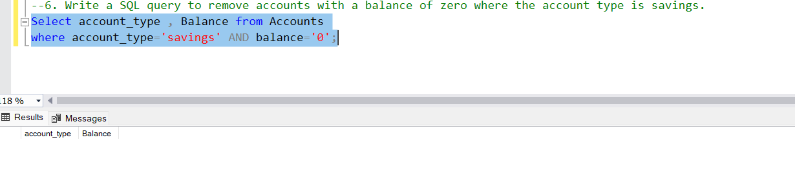

```sql
7. Write a SQL query to find customers living in a specific city.
 UPDATE Customers_1 SET address = '456 Oak Ave'
 where customer_id = 5;
   Select * from Customers_1;
    Select Customer_id ,CONCAT(first_name , last_name)  as full_name , address from Customers_1
	where address='456 Oak Ave';
```

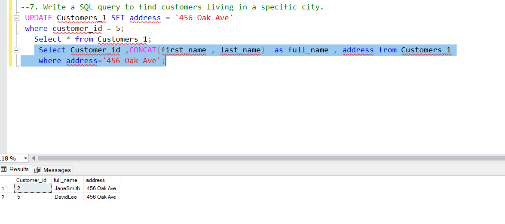

```sql
8. Write a SQL query to get the account balance for a specific account.
Select * from Accounts where account_id=4;
```

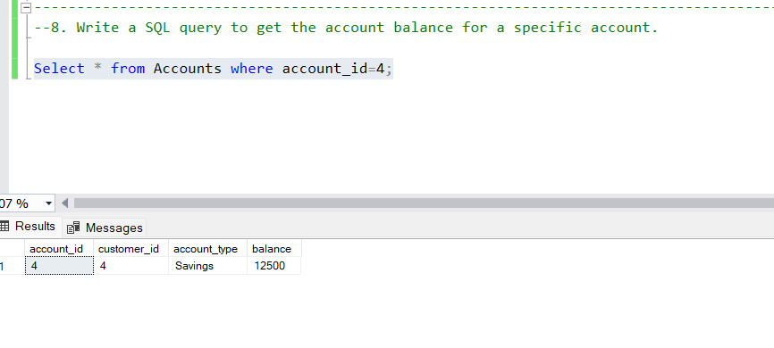

```sql
9. Write a SQL query to calculate the interest accrued on savings accounts based on a given interest rate.
Select Accounts.customer_id , avg( balance) as average  from Accounts
inner join  Customers on Customers.customer_id=Accounts.customer_id
group  by Accounts.customer_id;

```

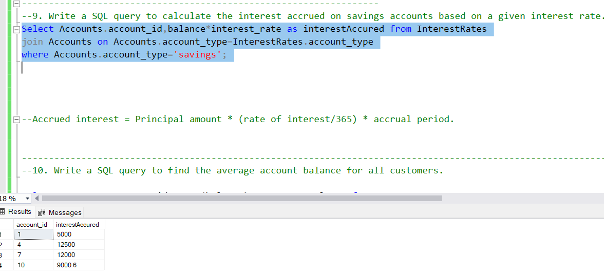

```sql
10. Write a SQL query to find the average account balance for all customers.
Select Accounts.customer_id , avg(balance) as AverageBalance from Accounts
inner join  Customers on Customers.customer_id=Accounts.customer_id
group  by Accounts.customer_id;
```

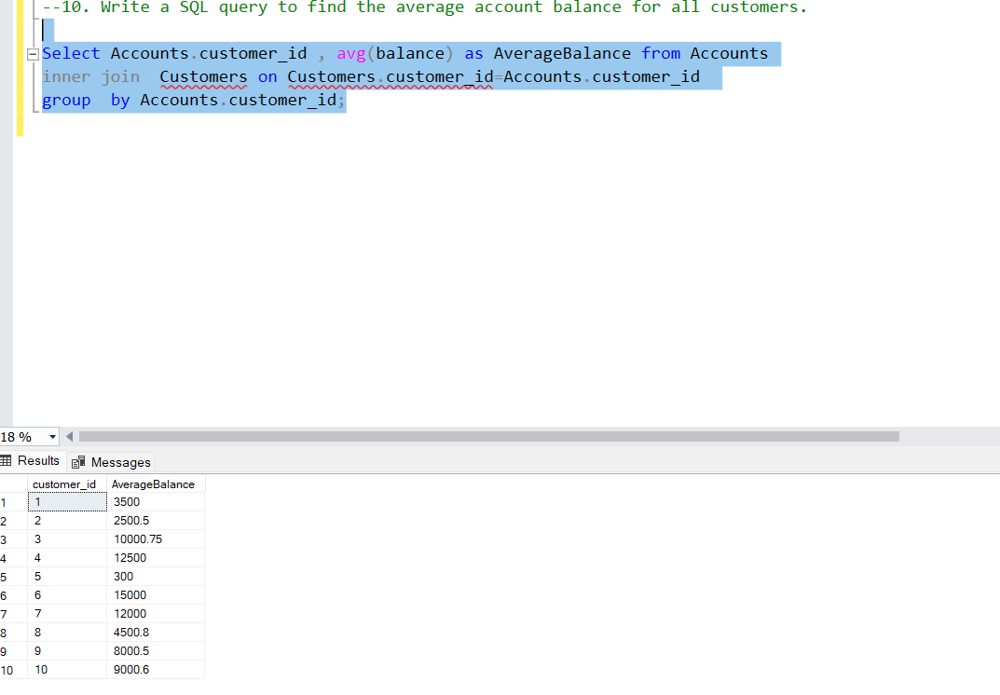

```sql
11. Write a SQL query to calculate the average daily balance for each account over a specified period.
Select Accounts.account_id, sum(balance)/7 as daily_avg from Accounts
join Transactions  on Accounts.account_id = Transactions.account_id
where transaction_date > getdate() - 7
group by Accounts.account_id;
```

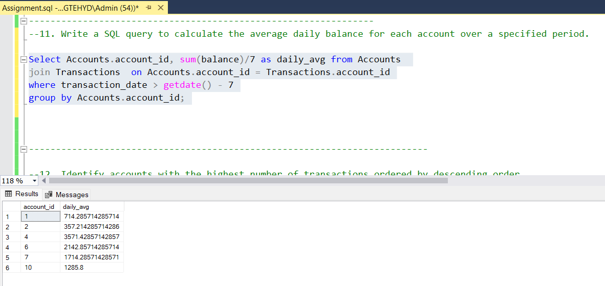

```sql
12. Identify accounts with the highest number of transactions ordered by descending order.

Select account_id,count(account_id) as count from Transactions group by account_id order by count(account_id) desc;
```

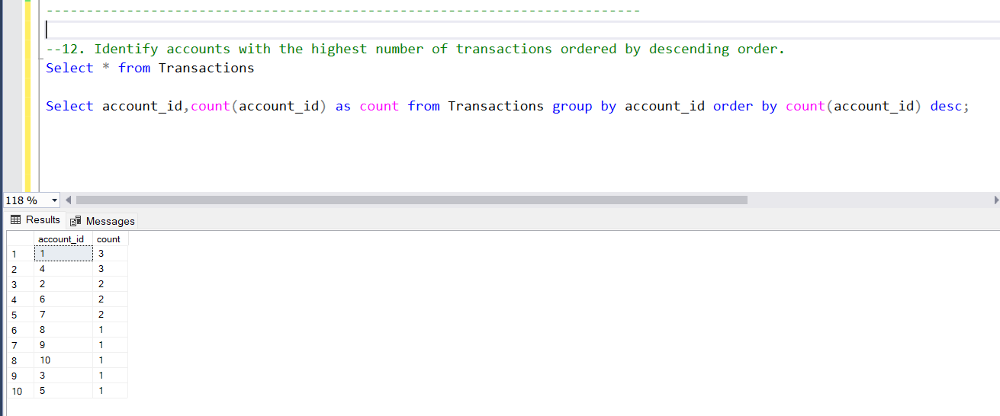

```sql
13. List customers with high aggregate account balances, along with their account types.
Select Customers.Customer_id ,CONCAT(Customers.first_name,Customers.last_name) AS FULLNAME,account_id ,account_type ,Sum(balance) as Balance from Accounts
inner join Customers on customers.customer_id=Accounts.customer_id
group by Customers.Customer_id,CONCAT(Customers.first_name,Customers.last_name), account_id,account_type order by SUM(balance) desc;
```

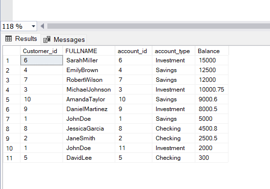

```sql
14. Identify and list duplicate transactions based on transaction amount, date, and account.
SELECT AMOUNT, transaction_date,Account_id,COUNT(*) FROM Transactions
GROUP BY AMOUNT, transaction_date,Account_id HAVING COUNT(*)>1;

```

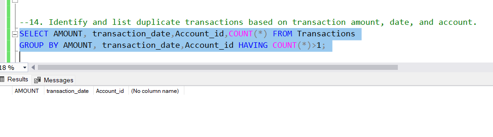

```sql
15. Calculate the total balance for each account type, including a subquery within the SELECT clause.
SELECT account_type,(SELECT SUM(balance) FROM Accounts
                   WHERE account_type = a.account_type) AS total_balance
                   FROM (SELECT DISTINCT account_type FROM Accounts) AS a;

```

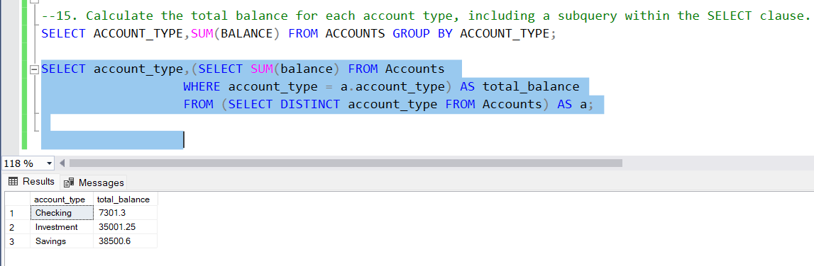
