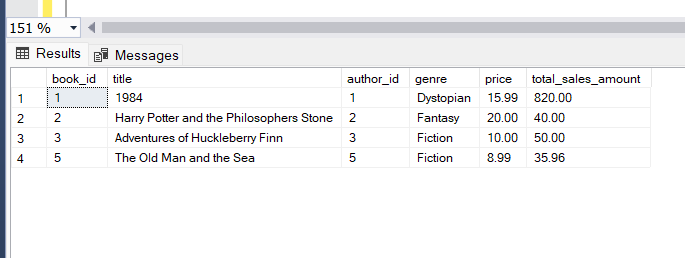

### Section 1: Questions

```sql
CREATE TABLE books (
    book_id INT PRIMARY KEY,
    title VARCHAR(200) NOT NULL,
    author_id INT NOT NULL,
    genre VARCHAR(50) NOT NULL,
    price DECIMAL(10, 2) NOT NULL
);

CREATE TABLE authors (
    author_id INT PRIMARY KEY,
    name VARCHAR(100) NOT NULL,
    country VARCHAR(50) NOT NULL,
    birth_year INT NOT NULL
);

CREATE TABLE sales (
    sale_id INT PRIMARY KEY,
    book_id INT NOT NULL,
    sale_date DATE NOT NULL,
    quantity INT NOT NULL,
    total_amount DECIMAL(10, 2) NOT NULL,
    FOREIGN KEY (book_id) REFERENCES books(book_id)
);

INSERT INTO authors (author_id, name, country, birth_year) VALUES
(1, 'George Orwell', 'UK', 1903),
(2, 'J.K. Rowling', 'UK', 1965),
(3, 'Mark Twain', 'USA', 1835),
(4, 'Jane Austen', 'UK', 1775),
(5, 'Ernest Hemingway', 'USA', 1899);

INSERT INTO books (book_id, title, author_id, genre, price) VALUES
(1, '1984', 1, 'Dystopian', 15.99),
(2, 'Harry Potter and the Philosophers Stone', 2, 'Fantasy', 20.00),
(3, 'Adventures of Huckleberry Finn', 3, 'Fiction', 10.00),
(4, 'Pride and Prejudice', 4, 'Romance', 12.00),
(5, 'The Old Man and the Sea', 5, 'Fiction', 8.99);

INSERT INTO sales (sale_id, book_id, sale_date, quantity, total_amount) VALUES
(1, 1, '2024-01-15', 3, 47.97),
(2, 2, '2024-02-10', 2, 40.00),
(3, 3, '2024-03-05', 5, 50.00),
(4, 4, '2024-04-20', 1, 12.00),
(5, 5, '2024-05-25', 4, 35.96);

Select *from books
Select *from authors
Select *from sales
```

```sql
--Task 1 : -Write a query to display authors who have written books in multiple genres and group the results by author name.

Select books.author_id ,authors.name ,books.genre ,count(genre)  as multiplegenres from authors
join books on books.author_id = authors.author_id
group by books.author_id ,authors.name ,books.genre
having count(genre)>1
```


```sql
---Task 2
--Write a query to find the books that have the highest sale total for each genre and group the results by genre.
with cte_sales
as (
Select  sales.book_id,title ,genre ,sales.total_amount,sum(sales.total_amount) as  SalesTotal ,
rank()over(partition by genre  order by  total_amount desc) as Ranks
from sales
left join books on books.book_id=sales.book_id
group by  sales.book_id ,title ,genre  ,sales.total_amount
)
 Select * from cte_sales
 where ranks=1 ;

```


```sql
--Write a query to find the average price of books for each author and group the results by author name, only including authors whose average book price is higher than the overall average book price.
with cte_prices
as (
 select authors.name, books.title , avg(price) as AvgPrice from books
 join authors on authors.author_id = books.author_id
 group by authors.author_id ,authors.name ,books.title ,books.price
 )
 Select * from cte_prices
 where AvgPrice>(select avg(price) from books );
```


```sql
----Task 4
--Write a query to find authors who have sold more books than the average number of books old per author and group the results by country.
with cte_sold
as (
Select authors.author_id, Avg(quantity ) as AvgBooks
from sales
 join books on books.book_id=sales.book_id
 join authors on authors.author_id=books.author_id
 group by authors.author_id
)
Select * from cte_sold
 where AvgBooks  > (Select Avg(quantity) from sales)
```


```sql
--Task 5
--Write a query to find the top 2 highest-priced books and the total quantity sold for each, grouped by book title.

Select top(2)  books.book_id, books.title,price ,quantity from books
join sales on sales.book_id=books.book_id
order by price desc
```


```sql
------Task 6
--Write a query to display authors whose birth year is earlier than the average birth year of authors from their country and rank them within their country.

Select  authors.author_id ,authors.country ,Avg(birth_year) as AvgBirthYear
,rank()over(partition by country  order by  birth_year desc) as Ranks
from sales
 join books on books.book_id=sales.book_id
 join authors on authors.author_id=books.author_id
 group by authors.author_id ,authors.country ,birth_year

Select *from books
Select *from authors
```


```sql
--Task 7
--Write a query to find the authors who have written books in both 'Fiction' and 'Romance' genres and group the results by author name.

Select authors.author_id  ,authors.name, books.genre
from books
left join authors on authors.author_id = books.author_id
group by authors.author_id,authors.name,books.genre having genre=('Fiction')
union
Select authors.author_id  ,authors.name, books.genre
from books
left join authors on authors.author_id = books.author_id
group by authors.author_id,authors.name,books.genre having genre=('Romance')

```


```sql
--Task 8
--Write a query to find authors who have never written a book in the 'Fantasy' genre and group the results by country.
Select authors.author_id, authors.country,books.genre
from books
left join authors on authors.author_id=books.author_id
group by authors.author_id , authors.country,books.genre
having genre!=('Fantasy') order by country
```


```sql
--Task 9
--Write a query to find the books that have been sold in both January and February 2024 and group the results by book title.
Select books.book_id , sale_date from sales
join books on books.book_id=sales.book_id
 where DATEPART(yy, sale_date) = 2024
 and DATEPART(mm, sale_date) = 01
 or DATEPART(mm, sale_date) = 02
```


```sql
--Task 10
---Write a query to display the authors whose average book price is higher than every book price in the 'Fiction' genre and group the results by author name.
with cte_Groups
as (
 select authors.author_id,authors.name,books.genre ,avg(price) as AvgPrices from books
 join authors on authors.author_id = books.author_id
 group by authors.author_id ,authors.name,books.genre,books.price having genre !='Fiction'

 )

 Select * from cte_Groups
 where  AvgPrices  >all(Select price from books
 where genre='Fiction');
```


### Section 2: Questions

```sql
--Task 1: Stored Procedure for Total Sales by Author
--Create a stored procedure to get the total sales amount for a specific author and write a query to call the procedure for 'J.K. Rowling'.
CREATE PROCEDURE GetTotalSalesByAuthor(@name VARCHAR(50))
as
BEGIN
    SELECT a.name AS author, SUM(s.total_amount) AS total_sales
    FROM authors a
    JOIN books b ON a.author_id = b.author_id
    JOIN sales s ON b.book_id = s.book_id
    WHERE a.name = name
    GROUP BY a.name;
end
exec GetTotalSalesByAuthor @name='J.K. Rowling';

```


```sql
--Task 2: Function to Calculate Total Quantity Sold for a Book
--Create a function to calculate the total quantity sold for a given book title and write a query to use this function for '1984'.
```

```sql
--Task 3: View for Best-Selling Books
--Create a view to show the best-selling books (those with total sales amount above $30) and write a query to select from this view. for above tables

CREATE VIEW BestSellingBooks
AS
SELECT b.book_id, b.title, b.author_id, b.genre, b.price,
SUM(s.total_amount) AS total_sales_amount
FROM books b
JOIN sales s ON b.book_id = s.book_id
GROUP BY b.book_id, b.title, b.author_id, b.genre, b.price
HAVING SUM(s.total_amount) > 30;

SELECT * FROM BestSellingBooks;

```



```sql
--Task 4: Stored Procedure for Average Book Price by Author
--Create a stored procedure to get the average price of books for a specific author and write a query to call the procedure for 'Mark Twain'. for above given table
CREATE PROCEDURE GetAverageBookPriceByAuthor( @name VARCHAR(50))
as
BEGIN
    SELECT a.name AS author, AVG(b.price) AS average_price
    FROM authors a
    JOIN books b ON a.author_id = b.author_id
    WHERE a.name = name
    GROUP BY a.name;
END

exec GetAverageBookPriceByAuthor
@name='Mark Twain';
```


```sql
--Task 5: Function to Calculate Total Sales in a Month
--Create a function to calculate the total sales amount in a given month and year, and write a query to use this function for January 2024.

```

```sql
--Task 6
--Task 6: View for Authors with Multiple Genres
--Create a view to show authors who have written books in multiple genres and write a query to select from this view.
CREATE VIEW Authors_MultipleGenres
AS
SELECT a.author_id,a.name AS author_name,
    COUNT(DISTINCT b.genre) AS num_genres
FROM authors a
JOIN books b ON a.author_id = b.author_id
GROUP BY a.author_id, a.name
HAVING COUNT(DISTINCT b.genre) > 1;

	SELECT *FROM Authors_MultipleGenres;

```


```sql
--Task 7: Ranking Authors by Total Sales
--Write a query to rank authors by their total sales amount and display the top 3 authors.
SELECT top(3) a.author_id, a.name AS author_name,
        SUM(s.total_amount) AS total_sales_amount,
        RANK() OVER (ORDER BY SUM(s.total_amount) DESC) AS sales_rank
    FROM authors a
    JOIN books b ON a.author_id = b.author_id
    JOIN sales s ON b.book_id = s.book_id
    GROUP BY a.author_id, a.name


```


```sql
--Task 8: Stored Procedure for Top-Selling Book in a Genre
--Create a stored procedure to get the top-selling book in a specific genre and write a query to call the procedure for 'Fantasy'.
CREATE PROCEDURE GetTopSellingBookInGenre(@genre VARCHAR(50))
as
BEGIN
    SELECT top(1)
        b.title,
        SUM(s.total_amount) AS total_sales
    FROM
        books b
    JOIN
        sales s ON b.book_id = s.book_id
    WHERE
        b.genre = genre
    GROUP BY
        b.title
    ORDER BY
        total_sales DESC
ENd

exec GetTopSellingBookInGenre  @genre='Fantasy'

```


### Section 3: Stored Procedures with Transactions and Validations

```sql
--1 Add New Book and Update Author's Average Price

--Create a stored procedure that adds a new book and updates the average price of books for the author. Ensure the price is positive, use transactions to ensure data integrity, and return the new average price.Delete Book and Update Author's Total Sales
```

```sql
--2 Create a stored procedure that deletes a book and updates the author's total sales. Ensure the book exists, use transactions to ensure data integrity, and return the new total sales for the author.
create procedure sp_DeleteBook
 @book_id int
 as
 begin
 begin transaction;
  BEGIN TRY
  if not exists (select * from books where book_id=@book_id)
  throw 50000,'Book not there',1;
  delete from books where  book_id=@book_id
  commit transaction;
   select sum(total_amount) as SalesPrice from sales
   where book_id in (select o.book_id from books o where author_id =   (select i.author_id from books i where i.book_id=@book_id));
  end try
  begin catch
  rollback transaction;
  print concat('error number:',error_number());
  print 'errormessage : ' + error_message();
  print concat('error state : ', error_state());
  end catch
  end
go
exec sp_DeleteBook @book_id =8
select * from books
```


```sql
--3  Transfer Book Sales to Another Book
--Create a stored procedure that transfers sales from one book to another and updates the total sales for both books. Ensure both books exist, use transactions to ensure data integrity, and return the new total sales for both books.
create procedure sp_transferSales
 @sale_id int ,@book1 int,@book2 int
 as
 begin
 begin transaction;
  BEGIN TRY
  if not exists (select * from books where book_id=@book1 )
  throw 50000,'Book not there',1;
  if not exists (select * from books where book_id=@book2 )
  throw 50000,'Book not there',1;
  if (select book_id from sales where sale_id=@sale_id )!=@book1  throw 50000,'invalid data',1;
  update  sales  set book_id=@book2
  where sale_id=@sale_id
  update sales
  set total_amount =(select quantity from sales where sale_id=@sale_id) * (select price from books where book_id=@book2)
  where sale_id=@sale_id
  commit transaction;
  end try
  begin catch
	rollback transaction;
	print concat('error number:',error_number());
	print 'errormessage : ' + error_message();
	print concat('error state : ', error_state());
  end catch
  end
go
exec sp_transferSales @sale_id=7,@book1=2,@book2=3select * from sales

```


```sql
--4.-Task 4: Add Sale and Update Book Quantity
--Create a stored procedure that adds a sale and updates the total quantity sold for the book. Ensure the quantity is positive, use transactions to ensure data integrity, and return the new total quantity sold for the book.
create procedure sp_Addsales@sale_id int,@book_id int ,@sale_date date ,@quantity int,@total_amount decimal(5,2)asbeginbegin transaction;
  BEGIN TRY
  if not exists (select * from books where book_id=@book_id)
  throw 50000,'book not there',1;
  if (@quantity<1)
  throw 50000,'quantity should be positive',1;
  insert into sales values  (@sale_id ,@book_id, @sale_date, @quantity, @total_amount);
  commit transaction;
   select sum(quantity ) as totalQty from sales where book_id=@book_id;
  end try
  begin catch
	rollback transaction;
  end catchendgoexec sp_Addsales @sale_id=6,@book_id =1 ,@sale_date = '2024-02-01', @quantity =4,@total_amount =63.96
  select * from sales
```


```sql
--task 5:Update Book Price and Recalculate Author's Average Price
--Create a stored procedure that updates the price of a book and recalculates the average price of books for the author. Ensure the price is positive, use transactions to ensure data integrity, and return the new average price.
create procedure sp_UpdateBookPrice
@book_id int,@price decimal(5,2)
as
begin
begin transaction;
  BEGIN TRY
  if not exists (select * from books where book_id=@book_id)
  throw 50000,'Book not there',1;
  if(@price<1)
  throw 50000,'price should be positive',1;
  Update  books set price=@price where  book_id=@book_id ;
  commit transaction;
    select avg(price) as averagePrice from books
  where author_id=(select author_id from books where book_id=@book_id) ;
  end try
  begin catch
  rollback transaction;
  print concat('error number:',error_number());
  print 'errormessage : ' + error_message();
  print concat('error state : ', error_state());
  end catch
  end
  go
  exec sp_UpdateBookPrice @book_id =2 ,@price =50
```


### SECTION 4 Advanced SQL Concepts

```sql
--task 1: Inline Table-Valued Function (iTVF)
--Create an inline table-valued function that returns the total sales amount for each book and use it in a query to display the results.
create function dbo.totalSalesforBook(@author_id int)
returns table
as
return(select book_id,sum(total_amount) as totalSales from sales
 group by book_id
 having book_id in(select book_id from books where author_id =@author_id))
 select * from  dbo.totalSalesforBook(2)

```

]

```sql
--task 2:Multi-Statement Table-Valued Function (MTVF)
--Create a multi-statement table-valued function that returns the total quantity sold for each genre and use it in a query to display the results.
create function dbo.totalQtyforGenre()
 returns @tempTb Table ( genre varchar(max),Qty int)
 as
 begin
 insert into @tempTb
 select b.genre, sum(s.quantity) as totalQty from sales s
 left join books b on b.book_id=s.book_id
 group by b.genre;return;
 end
 select * from dbo.totalQtyforGenre()
```


```sql
-- 3,task 3: Scalar Function
--Create a scalar function that returns the average price of books for a given author and use it in a query to display the average price for 'Jane Austen'.
create function dbo.avgPrice(@name varchar(max))
 returns int
 as
 begin
 declare @avg int
 set @avg =(select avg(price) from books
           where author_id=(select author_id from authors where name=@name));
		   return @avg
		   end
		   go
		   select dbo.avgPrice('Jane Austen');

```


```sql
--task 4: Stored Procedure for Books with Minimum Sales Create a stored procedure that returns books with total sales above a specified amount and use it to display books with total sales above $40.
create procedure sp_BookSales
 @totalSales int
 as
 begin
 select book_id , title from books
 where book_id in (select book_id  from sales group by book_id having sum(total_amount)>@totalSales)
 end
 exec sp_BookSales @totalSales=40
```


```sql
--task 5:Indexing for Performance Improvement Create an index on the sales table to improve query performance for queries filtering by book_id.
create nonclustered index ix_bookid on sales([book_id])
```


```sql
--6.
select a.author_id,a.name,a.country,a.birth_year,
(select b.book_id,b.title,b.genre,b.price from books b where b.author_id=a.author_id
for XML PATH('book'), type
)as books
from authors a for XML PATH('author'), root('authors')
--output
<authors>
  <author>
    <author_id>1</author_id>
    <name>George Orwell</name>
    <country>UK</country>
    <birth_year>1903</birth_year>
    <books>
      <book>
        <book_id>1</book_id>
        <title>1984</title>
        <genre>Dystopian</genre>
        <price>15.99</price>
      </book>
    </books>
  </author>
  <author>
    <author_id>2</author_id>
    <name>J.K. Rowling</name>
    <country>UK</country>
    <birth_year>1965</birth_year>
    <books>
      <book>
        <book_id>2</book_id>
        <title>Harry Potter and the Philosophers Stone</title>
        <genre>Fantasy</genre>
        <price>50.00</price>
      </book>
    </books>
  </author>
  <author>
    <author_id>3</author_id>
    <name>Mark Twain</name>
    <country>USA</country>
    <birth_year>1835</birth_year>
    <books>
      <book>
        <book_id>3</book_id>
        <title>Adventures of Huckleberry Finn</title>
        <genre>Fiction</genre>
        <price>10.00</price>
      </book>
    </books>
  </author>
  <author>
    <author_id>4</author_id>
    <name>Jane Austen</name>
    <country>UK</country>
    <birth_year>1775</birth_year>
    <books>
      <book>
        <book_id>4</book_id>
        <title>Pride and Prejudice</title>
        <genre>Romance</genre>
        <price>12.00</price>
      </book>
    </books>
  </author>
  <author>
    <author_id>5</author_id>
    <name>Ernest Hemingway</name>
    <country>USA</country>
    <birth_year>1899</birth_year>
    <books>
      <book>
        <book_id>5</book_id>
        <title>The Old Man and the Sea</title>
        <genre>Fiction</genre>
        <price>8.99</price>
      </book>
    </books>
  </author>
</authors>
```


```sql
--task 7: Export Data as JSON
--Write a query to export the authors and their books as JSON.
select a.author_id,a.name,a.country,a.birth_year,
(select b.book_id,b.title,b.genre,b.price from books b where b.author_id=a.author_id
for json PATH
)as books
from authors a
for json PATH, root('authors')
--output-
{"authors":[{"author_id":1,"name":"George Orwell","country":"UK","birth_year":1903,
"books":[{"book_id":1,"title":"1984","genre":"Dystopian","price":15.99}]},{"author_id":2,"name":"J.K. Rowling","country":"UK","birth_year":1965,
"books":[{"book_id":2,"title":"Harry Potter and the Philosophers Stone","genre":"Fantasy","price":50.00}]},{"author_id":3,"name":"Mark Twain","country":"USA","birth_year":1835,"books":[{"book_id":3,"title":"Adventures of Huckleberry Finn","genre":"Fiction","price":10.00}]},{"author_id":4,"name":"Jane Austen","country":"UK","birth_year":1775,"books":[{"book_id":4,"title":"Pride and Prejudice","genre":"Romance","price":12.00}]},{"author_id":5,"name":"Ernest Hemingway","country":"USA","birth_year":1899,"books":[{"book_id":5,"title":"The Old Man and the Sea","genre":"Fiction","price":8.99}]}]}

```


```sql
----task 8: Scalar Function for Total Sales in a Year-
---Create a scalar function that returns the total sales amount in a given year and use it in a query to display the total sales for 2024.

create function dbo.salesInYr(@yr int)
returns int
as
begin
declare @tolSales int
set @tolSales =(select sum(total_amount) from sales
           where year(sale_date)=@yr);return @tolSales
		   end
		   go
		   select dbo.salesInYr(2024);
```


```sql
--task 9:Stored Procedure for Genre Sales Report--
 --Create a stored procedure that returns a sales report for a specific genre, including total sales and average sales, and use it to display the report for 'Fiction'.
create procedure sp_GenreSalesReport
@genre varchar(max)
as
begin
select b.genre, sum(s.total_amount) as TotalSales,avg(s.total_amount) as avgSales from books b
join sales s on s.book_id=b.book_id
group by b.genre having genre=@genre
end
exec sp_GenreSalesReport @genre ='fiction'
```


```sql
--task 10: Ranking Books by Average Rating (assuming a ratings table)---
--Write a query to rank books by their average rating and display the top 3 books.-
Assume a ratings table with book_id and rating columns.
create table ratings (book_id int , rating int )
insert into ratings values( 1, 8 );
insert into ratings values( 2, 9 );
insert into ratings values( 3, 9 );
insert into ratings values( 4, 10 );
insert into ratings values( 5, 7 );

Select * from ratings
select top(3) b.title,b.book_id ,avg(r.rating) as avgRating from ratings r
left join books b
on b.book_id=r.book_id
group by b.title,b.book_id
order by avg(r.rating) desc

```


### Section 5: Questions for Running Total and Running Average with OVER Clause

```sql
-- 1 Running Total of Sales Amount by Book
--Create a view that displays each sale for a book along with the running total of the sales amount using the OVER clause.
Create view vwEachSaleOfBooks
 as
 Select books.book_id ,
 Sum(total_amount) Over (Partition By books.book_id Order By total_amount ) As HighestRank
from sales
left join books on books.book_id=sales.book_id

Select * from vwEachSaleOfBooks

```


```sql
--2 Running Total of Sales Quantity by Author
--Create a view that displays each sale for an author along with the running total of the sales quantity using the OVER clause.
Create view vwSaleforAuthor
 as
 Select  authors.author_id ,authors.name ,sales.sale_id,
Sum(quantity) Over (Partition By authors.author_id Order By sales.quantity ) As RunningTotal
from sales
left join books  on books.book_id = sales.book_id
 join authors on authors.author_id =books.author_id

Select * from vwSaleforAuthor
```


```sql
--3  Running Total and Running Average of Sales Amount by Genre
----Create a view that displays each sale for a genre along with both the running total and the running average of the sales amount using the OVER clause.
Create view vwSaleforGenre
as
select authors.author_id,genre ,
sum(total_amount) Over (Partition By books.genre Order By sales.total_amount ) As RunningTotal,
Avg(total_amount) Over (Partition By books.genre Order By sales.total_amount ) As RunningAvg
from sales
join books on books.book_id=sales.book_id
join authors on authors.author_id =books.author_id

Select * from vwSaleforGenre
```


### Section 6: Triggers

```sql
---1.Trigger to Update Total Sales After Insert on Sales Table Create a trigger that updates the total sales for a book in the books table after a new record is inserted into the sales table.
alter table books add total_sales decimal(6,2) --need to create column
 update  books set total_sales=820.00 where book_id =1;
  update  books set total_sales=40.00 where book_id=2;
  update  books set total_sales=50.00 where book_id=3;
  update  books set total_sales=12.00 where book_id=4;
  update  books set total_sales=35.00 where book_id=5;


create Trigger trg_SalesInsert
on sales
 After insert
  as
  Begin
  update books
  set total_sales=total_sales + (select total_amount from inserted )
  where book_id= (select book_id from inserted )
  end
  go

  insert into sales values (6 , 4, '2024-02-15', 4,56.50 )

  Select * from sales
  Select * from books
```


```sql
--2.Trigger to Log Deletions from the Sales Table
--Create a trigger that logs deletions from the sales table into a sales_log table with the sale_id, book_id, and the delete_date.
Create table sales_log (sale_id int , book_id int, delete_date date)

Create trigger trg_LogDeletions
on sales
after delete
as
begin
 Insert into sales_log values (
	  (select sale_id from deleted ) ,(select book_id from deleted ) ,getdate() );

end
 go

 delete from sales where sale_id=6
 Select * from sales_log
 Select * from books
```


```sql
--3 .Trigger to Prevent Negative Quantity on Update
--Create a trigger that prevents updates to the sales table if the new quantity is negative.


```
