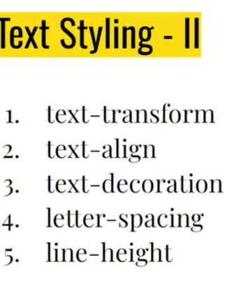

# INTRO TO WEB DEVELOPMENT

## Browser wars - I:

```js
The war between Nescape and IE

## 3 layer architecure

1. FE
   - Angular
   - React
2. DB
3. BE
   - Python
   - NodeJS
   - Java

## References

- "https://www.youtube.com/watch?v=CZ3wIuvmHeM"
```

```js
## INTRO TO JAVASCRIPT:

- variable declaration : var = ""
- To check data type : type(variable)
  - ex: typeof("x")= string

### Data types in js:

- String
- Number
- Boolean
- Undefined
- Symbol
- Object

### variable declarations :

- let :reassign is possible but,
- var :can be changed or redeclarable,reassign possible.
- constant :can't be changed,reassign not possible

### Scope

- life of variable:
 block of code in a program,unless the varaible is used it will be there in memory,next deleted/no longer there in memory.

//undefined means = value

//not define means= error
```

### TypeCasting

```js
- In JS ,the priority of functions ids performed and it follows implict coercion (decide it self)

 ex : var x1=3;
var x2="4";
console.log(x1+x2); ==>35
console.log(x1-x2); ==> -2

  explicit coercion: ex:
   var x1=3;
   var x2="5";
   console.log(x1+parseInt(x2)); =>8
   console.log(x1+ +x2); ==>

   Examples
     null+5 = 5
     [2,3,5]+"abc" ='2,3,5abc'
     []+[] =''
     4\*"5a" = not a number
     NaN/4 = NaN
     typeof(NaN) ='number'
     NaN\*3 = NaN
```

\*\* == allows type conversions , where === not converts and only one step.
2 ways to exit function : return,

```js
###  Types of functions
- 1.normal
  function double(n) {
    return n * 2;
  }

- 2.arrow

  - const double= (n) => {
  - return n\*2;
  - }
  - or " const double = (n)=> n\*2;

- 3.anonymous

- 4.IIFE
```

### 5 pillars of code quality

```js
 1.Readability - 75%
 2.Maintainability- Code Debt(delaying tasks to tommorow)
 3.Extensibility-easy to add new features
 4.Testability-
 5.Performance
```

### coby value

```js
var q1=[100,200];
var q3=q1;
=>not defined
```

### spreading operator(copy by value)

```js
var q1=[100,200];
var q3=[...q1];
console.log(q3);
output : [100,200]

var t1=[400,500];
var t2=[90,80];
var t3=[t2,...t1];
console.log(t3);

output: t3->[90,80,400,500]

```

### Loops

```js
//More control
const marks=[80,90,100];
for (let  i=0;i<marks.length;i++)
    {
        console.log("Index:","Mark:",marks[i]);  =>[80, 90, 100]
    }
//Readable and simple
for(let idx in marks)
    {
    console.log("Index:","Mark:",marks[idx]);
}
//Readable and cleaner
for(let mark in marks)
    {
    console.log("Mark:", mark);}

```

#### Example

```js
const cart = [
    { name: "Apple", price: 0.5, quantity: 4 },
    { name: "Banana", price: 0.25, quantity: 6 },
  ];

  const newItems = [
    { name: "Cherry", price: 0.75, quantity: 5 },
    { name: "Date", price: 1, quantity: 3 },
  ];

  //Ex 1.1: Combine cart + newItems

  const Items(){
    console.log(...cart,...newItems);
  }

// find the total of cart
let total=0;
   for(let item of allitems){
    total+=item.price*item.quality;
   }
   console.log("The cart total is:", total);

```

## Examples

```js
const books = [
  { title: "Infinite Jest", rating: 4.5, genre: "Fiction" },
  { title: "A Brief History of Time", rating: 4.8, genre: "Science" },
  { title: "The Catcher in the Rye", rating: 3.9, genre: "Fiction" },
  { title: "Sapiens", rating: 4.9, genre: "History" },
  { title: "Clean Code", rating: 4.7, genre: "Technology" },
];

for (let i = 0; i <= books.length; i++) {
  if (books[i].rating > 4.7) console.log(books[i].title);
}

// ANOTHER

for (let book of books) {
  if (book.rating >= 4.7) {
    console.log(book.title);
  }
}

//ANOTHER
let highRatedBooks = [];
{
  //camel case
  if (book.rating >= 4.7) {
    highRatedBooks.pudh(book.title);
  }
}
```

```js
// Ex 3: If employee's grades 80 or above promote them
const employes = [
  { id: 1, name: "Alice", grade: 78 },
  { id: 2, name: "Bob", grade: 85 },
  { id: 3, name: "Charlie", grade: 92 },
  { id: 4, name: "David", grade: 88 },
  { id: 5, name: "Eva", grade: 76 },
];

var j = [];
for (let i = 0; i < employes.length; i++) {
  if (employes[i].grade > 80)
    j.push({ id: employes[i].id, status: "promoted" });
}
console.log(j);

// This should output:
// [{ id: 2, status: 'Promoted' }, { id: 3, status: 'Promoted' }, { id: 4, status: 'Promoted' }]
```

```js

const movies = [
    { title: "Inception", ratings: [5, 4, 5, 4, 5] },
    { title: "Interstellar", ratings: [5, 5, 4, 5, 4] },
    { title: "Dunkirk", ratings: [4, 4, 4, 3, 4] },
    { title: "The Dark Knight", ratings: [5, 5, 5, 5, 5] },
    { title: "Memento", ratings: [4, 5, 4, 5, 4] },
  ];

  // Function to calculate the average rating for a movie
  function calculateAverageRating(ratings) {
    const total = ratings.reduce((sum, rating) => sum + rating, 0);
    return total / ratings.length;
  }

  // Find the movie with the highest average rating
  let topMovie = null;
  let highestAverageRating = -1;

  movies.forEach(movie => {
    const averageRating = calculateAverageRating(movie.ratings);
    if (averageRating > highestAverageRating) {
      highestAverageRating = averageRating;
      topMovie = movie.title;
    }
  });

  console.log("Top 1 movie title:", topMovie);

     output: The Dark night
```

### ES6 feature

```js
let & const
`` Template literal
classesArow functions
promise
Destructing
numeric seperators
sprrd opeartor
```

### Object methods

```js
Object.key() and Object.value()

```

### Template literal

```js
interpolation - substitution
Supports multiline string
```

### refactoring -

```js
 improves quality and the functionality is same as before
```

### Array Destructuring(unpacking done using index value)

```js
const[t1,t2]=[100,200];
console.log(t1,t2,t3);
output= t3 will be undefined.


const[t1,t2,t3=30]=[100,20];
console.log(t1,t2,t3);
output: 100,20,30
***default value is taken only t3 is undefined***

const[t1,t2,t3=30]=[100,20,500];
console.log(t1,t2,t3);
output:100,20,500


const[t1,t2,t3=30]=[100,20,null];
console.log(t1,t2,t3);
output:100,20,null

const[t1,t2,t3=30]=[100,20,undefined];
console.log(t1,t2,t3);
output: 100 20 30

const[,t1,t2,t3=30]=[100,200,null]; syntax called as Holes(to skip values)
console.log(t1,t2,t3);
VM64:2 200 null 30

```

### Object Destructuring

```js
unpacking things using keys
as like array desturing ,it will uses objects.
```

### Binary operators

```js
arithmetic - +,-,*,/
Logical- &&,||
realational - >,<,>=,<=,==,===
```

### Ternary

```js
4 > 3 ? "Awesome" : "cool";
```

### Unary operator

```js
++, --, !
```

### Truthy vs Falsy ; if value converts into "true" then Truthy ,Vise versa

```js
let x="cool";
if (x)
{
  console.log("Hey");
  }
  else
  {
    console.log("Nope');
  }
    output : Hey
```

### String inbuilt methods

```js
"Hemasri".toUpeerCase()   => 'HEMASRI'
"Hemasri".toLowerCase()    =>'hemasri'
"this is a girl".split()   =>['this','is','a','girl']
['this','is','a','girl'].join("|") =>'this|is|a|girl'
"hemasri".split("")   =>['h','e','m','e','s','r','i']

```

### EXAMPLE

```js
function transformSentence(sentence){
return sentence.toUpperCase().split(" ").reverse().join(" ");
}
let sentence = "Hello world from JavaScript";
let transformed = transformSentence(sentence);
console.log(transformed);
 output => JAVASCRIPT FROM WORLD HELLO


function processNames(names) {
let result = [];
for (let i = 0; i < names.length; i++) {
let upperCaseName = names[i].toUpperCase();
let nameParts = upperCaseName.split(" ");
let joinedName = nameParts.join("_");
result.push(joinedName);
}
return result;
}
const namesArray = ["john doe", "jane smith", "alice jones"];
console.log(processNames(namesArray));
```

### Software Development life cycle:

```js
Planning : done by CEO
Analysis :types:technical,business analysis
Design :Auto layout +variance
Implementation: Done by Developers
Testing and integration:
Maintenance : Done by support team
```

### Stakeholder:

```js
A stakeholder is a person, group or organization with a vested interest, or stake, in the decision-making and activities of a business, organization or project.
```

### 6 phases of SDLC

```js
1.Analysis: product owner,project manager,business analyst,CTO
2.Design:System architect,UI/UX designer
3.Development:Front and Back end Developers
4.Testing:Solution Architect,QA engineer,Tester,DevOps
5.Deployment:Data Adminstrator,DevOps
6.Maintenance: User,testers,Support Managers
```

### METHODOLOGY


### scrum (Scrum is an empirical process, where decisions are based on observation, experience and experimentation.)


```js
1 sprint = 2weeks
sprint palnning 1 hour.
standup meeting- 10-15 minutes.(what did yesterday ,and what has to to today)
```

### Canban Board


### Spill over( work was not completed in 1 sprint,it will continue or add in another sprint)

## Coding standards

Are meant have uniformity through outnyour code base.

### Code quality (checked in Review by Reviewer)

### Dry (Don't Repeat your self )

### variables name (understandable / descriptive)

```js
let a = 50; //❌
let age = 50; // 💯
```

```js
camelcase:
let student_name="hemasri"; //❌
let studentName="hemasri"; //💯

```

```js
choose let over var ,const over let
let panCard= "BNLPH456"; // ❌
let PAN_CARD= "BNLPH456"; //💯
```

### Write your const case

```js
const piValue = "3.24"; //❌
const PI_VALUE = "3.14"; //💯
```

### Errors ( for Variable name)

Reserved keywords (if,for)

```js
let if= "hemasri";//❌
```

Cannot start with numbers

```js
let2cool = "hemasri"; //❌
```

cannot have sepecial characters ($,@,#,!)(except for'\_')

```js
let abc$123 = "hemasri"; //❌
let abc_123 = "hemasri"; // 💯
```

## Documentation

- single line comment

```js
//
```

- Multiple line comment

```js
/**
 * This is cool
 * function
 *
 */
```

### Write a function

/\*\*

- Multiplies two numbers
- @param {number} x - The first number.
- @param {number} y - The second number.
- @returns {number} The product of x and y.
- @example
- multiply(2, 3); // returns 6
  _/
  function multiply(x, y) {
  return x _ y;
  }
  \*/
  // Write a function to make it uppercase
  \*\*

- converts the text into uppercase
- @param {string} text
- @return {string} Uppercase left
- convert ToUppercase("hello"); // returns "HELLO" \*

```js
funtion convertToUppercase(text)
{
return text.toUppercase();
}
```

### GIT INTRO ( "Linus Torvalds")

- 1 st create an empty folder
- open folder, create a file and open in vs code
- open terminal -
  
  - git init - one time starting of project
  - git add . - adding all the changes to staging
  - git reset : to delete/ discard changes
  - git checkout - . : returns to previous commit
  - git switch - return to the master( starting)
  - git status - shows the ststus of the file like modified,staged
  - git cm "mistake name"
  - git log -1 : to check recent one commit
  - git commit
  - git log --author
  - git revert- used to remove,or add changes,vs
  - w = write / save
  - q = quit
- vim file name- vim terminal opens
  - j - down
  - k - up
  - n- backward
  - N- forward
  - l - for right
  - h - for left
  - w - word forward movement
  - b - backward
  - dw = delete a word
  - u = undo a word
  - d2w - delete 2 words
  - verb + Number + Movement =
  - yank means copy - y
  - i"- change /delete/yank inside a pair of quotes
  - : , wq - used to quit vim terminal
  - git branch --all = to show all branches
  - git behind - extra commits in main branch
  - git a head-prsent commits added to main.
  - git pull = updated online to offline.
    - Better command git pull --rebase origin dev -> dev branch
  - git push = updated to online.
- git squash - hides code ( can't push to online )
  - git squash apply - recovers / retrives hided code
- rebase - combines all commits together
  - keeping the history in straight line.
  - we can eaily identify the bug by using binary search.[ command : git bisect]
  - rebase won't perform on master,staging,dev
    it only applies on features.
  - git rebase -i HEAD~4
- merge types : fast forward , merge commit

  - git revert- used to remove,or add changes,vs

  


### staging version


## Git vs GitHub

git - software , version control system ,use without internet to do Some work.Distributed system ( Backup possible).
used for colloborative work.
gitHub- service,used to store files.
staging area : staging area gives you space to prepare (stage) the changes that will be reflected on the next commit.
commit stage:

- commit until code work
- small multiple commits
- load works
- commit msg should be precise

### Terminology

- Configuration management : configuration management is an IT management process that tracks individual configuration items of an IT system( code)

  - CI : configuration item : Git Files ->source code
  - Audit : by doing frequent commits -> signature
    - Git blame : used to check the who did what changes by providing names of that assignee.
    - Git difference
  - Baseline - commits , Tags
  - Accounting - git log , git blame - who did it,when they did it, what they did.
  - Change Management - maintained using branches and Pull requests.
    implement strategies for effecting and controlling change and helping people to adapt to change.

  Advantages :

  - Traceability - who?, why?
  - maintain code quality and have consistency
  - Reduces risks , avoid errors - because there is a backup
  - smooth process -> Change management.

- Release management : the process of planning, designing, scheduling, testing, deploying, and controlling software releases.
  - Planning : to implement we have branching strategies
  - Governance : Access level for each branch like authority
  - Scheduling : Through Sprints in agile
  - Automation : CI / CD -> continous integration & deployment , to reduce human error
  - contingency : Backup plan , rollback old version

### SAAS : All web apps

### PAAS : Netlify , Rendor , Railway , Vercel . It provides environment, we have to use it to develop and used by Freelancers, developers.

### IAAS : AWS , Microsoft Azure


## HTML

## CSS

Types:


### Text styling





### Database

- collection of data in a systematic format.
- cloud:Renting data/pc
  -> only provide service, we can install - any softwares in it.
  -> providers
  
- if we are buying cloud:
  
- if we are renting:

- Disaster management : if there is any disaster happens, they can backup.
- Scaling : adding more customers by providing more products
  1.vertical scaling[ making pc powerful], 2.Horizontal scaling [adding more computers]
  
  3 .Auto scaling[Pay as per use]
  
  DDOS :load increases to site ,Attackimg from multiple users
  
  
- PC : 
- Operating system :

Most used os -> Linux

- advantages of linux : 1. Free of cost 2. Open source: Boat example 3.secure ,4.small footprint : Alpine-256MB[ moste used linux] it takes lesser money ,5.Automation[managing anything from terminal]


### why we need database ?

frequently asked data was stored in RAM ,

- Features

1. Database -Frequently asked will have it in the RAM
2. Qyerying becomes easier
3. CRUD - easy
4. Backups are inbuilt
5. Undo- Easily(Time limit)
6. Performance

### SQL : stored in

Example : PLSQL , MySql , PostgreSQL , amazonRDS

### NoSQL Stored in Files

Examples : MongoDB , couchDB , redis , cassandra [ Neflix used this DB] , DynamoDB , neo4j

### Normalization : to reduce redundency , anamoly, inconsistency

- used for safety of database [ to avoid anamoly]
  
  ![[alt text]](image-36.png)
  
  
  
  

### joins : for safety , to divide and slove problem


### INNER JOIN - EXAMPLE


### LEFT JOIN - EXAMPLE


### RIGHT JOIN -EXAMPLE


### FULL JOIN- EXAMPLE


### Aggregation : to summarize things

### Group By [Every KEYWORD ]

### DATA TYPES

- Integer - for numbers
- Boolean - for 0 , 1
- Float, double , real - can store precise numerical data like fractional
- CHARACTER(num_chars) , VARCHAR(num_chars) - limited text or sentence , TEXT - Text based datatypes
- DATE , DATETIME - for dates , times
- BLOB [Binary Large Object] - Path of data / file stored in filesystem.

### CONSTRAINTS : Validating whether a data is Correct or not

- Primary Key - unique , not null , must contain 1 pk in a table
- Autoincrement - value is automatically filled in database.
- Unique -
- Not Null - not empty
- CHECK(Expression) -
- FOREIGN KEY - PK in another table
- Foreign key constarint - when we want to insert data in fk , it will checks the data in pk and returns the error.

  
  

### INT TYPES

- Int : -2B , 2Billions
- smallint : -32k , 32k
- Bigint : 9*10^8 , 9*10^8

### String Types - Stored in unique codes.

- Varchar : Letter is stored as 2 character
- n varchar : letter is stored as 1 characters
- nvarchar MAX - used for large strings.

### Date

- date time
- date
- time

### Decimal types

- Decimal (Exact) : Exact but performace was looses
- Float (Approx) : Performance is good

### Boolean types : stored in Bit

- 0 , 1 : True , False

### Functions

- Aggregate : sum,count.max,min,

- String Functions

```sql
-- 1.Len
select Len('hemasri') as NameLength

-- 2. Left
select Left('hemasri', 02)

--3. Rightt
select Right('hemasri', 1)

-- 4.Lower
select Lower('HEMASRI')

--5. Upper
select Upper('hemasri')

-- 6.substring : from 2 and upto 3 letters
select substring('hemasri',2,3)

--7.Ltrim
select Ltrim('hemasri','h') as NameLength

--8.Rtrim
select Rtrim('hemasri','sri')

--9.CharIndex
select CharIndex('hemasri','r')

-- 10.Replace
select Replace(5,'hemasri','kavya')

-- 11 Concat
select Concat('hemasri','54')
```

- File format
  
- Mathematical functions
  
