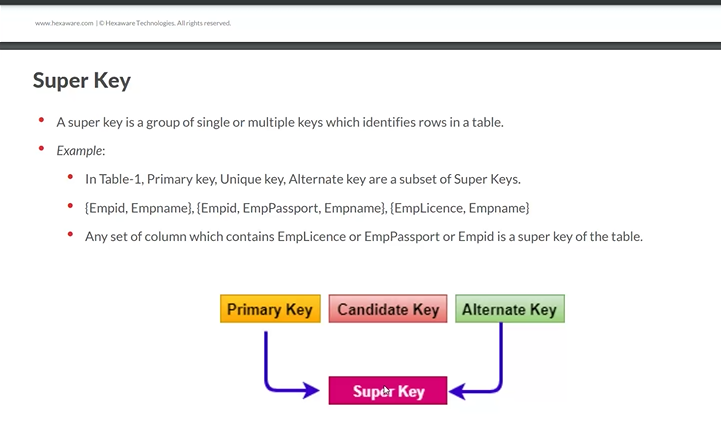

# INTRO TO WEB DEVELOPMENT

## Browser wars - I:

```js
The war between Nescape and IE

## 3 layer architecure

1. FE
   - Angular
   - React
2. DB
3. BE
   - Python
   - NodeJS
   - Java

## References

- "https://www.youtube.com/watch?v=CZ3wIuvmHeM"
```

```js
## INTRO TO JAVASCRIPT:

- variable declaration : var = ""
- To check data type : type(variable)
  - ex: typeof("x")= string

### Data types in js:

- String
- Number
- Boolean
- Undefined
- Symbol
- Object

### variable declarations :

- let :reassign is possible but,
- var :can be changed or redeclarable,reassign possible.
- constant :can't be changed,reassign not possible

### Scope

- life of variable:
 block of code in a program,unless the varaible is used it will be there in memory,next deleted/no longer there in memory.

//undefined means = value

//not define means= error
```

### TypeCasting

```js
- In JS ,the priority of functions ids performed and it follows implict coercion (decide it self)

 ex : var x1=3;
var x2="4";
console.log(x1+x2); ==>35
console.log(x1-x2); ==> -2

  explicit coercion: ex:
   var x1=3;
   var x2="5";
   console.log(x1+parseInt(x2)); =>8
   console.log(x1+ +x2); ==>

   Examples
     null+5 = 5
     [2,3,5]+"abc" ='2,3,5abc'
     []+[] =''
     4\*"5a" = not a number
     NaN/4 = NaN
     typeof(NaN) ='number'
     NaN\*3 = NaN
```

\*\* == allows type conversions , where === not converts and only one step.
2 ways to exit function : return,

```js
###  Types of functions
- 1.normal
  function double(n) {
    return n * 2;
  }

- 2.arrow

  - const double= (n) => {
  - return n\*2;
  - }
  - or " const double = (n)=> n\*2;

- 3.anonymous

- 4.IIFE
```

### 5 pillars of code quality

```js
 1.Readability - 75%
 2.Maintainability- Code Debt(delaying tasks to tommorow)
 3.Extensibility-easy to add new features
 4.Testability-
 5.Performance
```

### copy value

```js
var q1=[100,200];
var q3=q1;
=>not defined
```

### spreading operator(copy by value)

```js
var q1=[100,200];
var q3=[...q1];
console.log(q3);
output : [100,200]

var t1=[400,500];
var t2=[90,80];
var t3=[t2,...t1];
console.log(t3);

output: t3->[90,80,400,500]

```

### Loops

```js
//More control
const marks=[80,90,100];
for (let  i=0;i<marks.length;i++)
    {
        console.log("Index:","Mark:",marks[i]);  =>[80, 90, 100]
    }
//Readable and simple
for(let idx in marks)
    {
    console.log("Index:","Mark:",marks[idx]);
}
//Readable and cleaner
for(let mark in marks)
    {
    console.log("Mark:", mark);}

```

#### Example

```js
const cart = [
    { name: "Apple", price: 0.5, quantity: 4 },
    { name: "Banana", price: 0.25, quantity: 6 },
  ];

  const newItems = [
    { name: "Cherry", price: 0.75, quantity: 5 },
    { name: "Date", price: 1, quantity: 3 },
  ];

  //Ex 1.1: Combine cart + newItems

  const Items(){
    console.log(...cart,...newItems);
  }

// find the total of cart
let total=0;
   for(let item of allitems){
    total+=item.price*item.quality;
   }
   console.log("The cart total is:", total);

```

## Examples

```js
const books = [
  { title: "Infinite Jest", rating: 4.5, genre: "Fiction" },
  { title: "A Brief History of Time", rating: 4.8, genre: "Science" },
  { title: "The Catcher in the Rye", rating: 3.9, genre: "Fiction" },
  { title: "Sapiens", rating: 4.9, genre: "History" },
  { title: "Clean Code", rating: 4.7, genre: "Technology" },
];

for (let i = 0; i <= books.length; i++) {
  if (books[i].rating > 4.7) console.log(books[i].title);
}

// ANOTHER

for (let book of books) {
  if (book.rating >= 4.7) {
    console.log(book.title);
  }
}

//ANOTHER
let highRatedBooks = [];
{
  //camel case
  if (book.rating >= 4.7) {
    highRatedBooks.pudh(book.title);
  }
}
```

```js
// Ex 3: If employee's grades 80 or above promote them
const employes = [
  { id: 1, name: "Alice", grade: 78 },
  { id: 2, name: "Bob", grade: 85 },
  { id: 3, name: "Charlie", grade: 92 },
  { id: 4, name: "David", grade: 88 },
  { id: 5, name: "Eva", grade: 76 },
];

var j = [];
for (let i = 0; i < employes.length; i++) {
  if (employes[i].grade > 80)
    j.push({ id: employes[i].id, status: "promoted" });
}
console.log(j);

// This should output:
// [{ id: 2, status: 'Promoted' }, { id: 3, status: 'Promoted' }, { id: 4, status: 'Promoted' }]
```

```js

const movies = [
    { title: "Inception", ratings: [5, 4, 5, 4, 5] },
    { title: "Interstellar", ratings: [5, 5, 4, 5, 4] },
    { title: "Dunkirk", ratings: [4, 4, 4, 3, 4] },
    { title: "The Dark Knight", ratings: [5, 5, 5, 5, 5] },
    { title: "Memento", ratings: [4, 5, 4, 5, 4] },
  ];

  // Function to calculate the average rating for a movie
  function calculateAverageRating(ratings) {
    const total = ratings.reduce((sum, rating) => sum + rating, 0);
    return total / ratings.length;
  }

  // Find the movie with the highest average rating
  let topMovie = null;
  let highestAverageRating = -1;

  movies.forEach(movie => {
    const averageRating = calculateAverageRating(movie.ratings);
    if (averageRating > highestAverageRating) {
      highestAverageRating = averageRating;
      topMovie = movie.title;
    }
  });

  console.log("Top 1 movie title:", topMovie);

     output: The Dark night
```

### ES6 feature

```js
let & const
Template literal
classesArow functions
promise
Destructing
numeric seperators
spread opeartor
```

### Object methods

```js
Object.key() and Object.value()

```

### Template literal

```js
interpolation - substitution
Supports multiline string
```

### refactoring -

```js
 improves quality and the functionality is same as before
```

### Array Destructuring(unpacking done using index value)

```js
const[t1,t2]=[100,200];
console.log(t1,t2,t3);
output= t3 will be undefined.


const[t1,t2,t3=30]=[100,20];
console.log(t1,t2,t3);
output: 100,20,30
***default value is taken only t3 is undefined***

const[t1,t2,t3=30]=[100,20,500];
console.log(t1,t2,t3);
output:100,20,500


const[t1,t2,t3=30]=[100,20,null];
console.log(t1,t2,t3);
output:100,20,null

const[t1,t2,t3=30]=[100,20,undefined];
console.log(t1,t2,t3);
output: 100 20 30

const[,t1,t2,t3=30]=[100,200,null]; syntax called as Holes(to skip values)
console.log(t1,t2,t3);
VM64:2 200 null 30

```

### Object Destructuring

```js
unpacking things using keys
as like array desturing ,it will uses objects.
```

### Binary operators

```js
arithmetic - +,-,*,/
Logical- &&,||
realational - >,<,>=,<=,==,===
```

### Ternary

```js
4 > 3 ? "Awesome" : "cool";
```

### Unary operator

```js
++, --, !
```

### Truthy vs Falsy ; if value converts into "true" then Truthy ,Vise versa

```js
let x="cool";
if (x)
{
  console.log("Hey");
  }
  else
  {
    console.log("Nope');
  }
    output : Hey
```

### String inbuilt methods

```js
"Hemasri".toUpeerCase()   => 'HEMASRI'
"Hemasri".toLowerCase()    =>'hemasri'
"this is a girl".split()   =>['this','is','a','girl']
['this','is','a','girl'].join("|") =>'this|is|a|girl'
"hemasri".split("")   =>['h','e','m','e','s','r','i']

```

### EXAMPLE

```js
function transformSentence(sentence){
return sentence.toUpperCase().split(" ").reverse().join(" ");
}
let sentence = "Hello world from JavaScript";
let transformed = transformSentence(sentence);
console.log(transformed);
 output => JAVASCRIPT FROM WORLD HELLO


function processNames(names) {
let result = [];
for (let i = 0; i < names.length; i++) {
let upperCaseName = names[i].toUpperCase();
let nameParts = upperCaseName.split(" ");
let joinedName = nameParts.join("_");
result.push(joinedName);
}
return result;
}
const namesArray = ["john doe", "jane smith", "alice jones"];
console.log(processNames(namesArray));
```

### Software Development life cycle:

```js
Planning : done by CEO
Analysis :types:technical,business analysis
Design :Auto layout +variance
Implementation: Done by Developers
Testing and integration:
Maintenance : Done by support team
```

### Stakeholder:

```js
A stakeholder is a person, group or organization with a vested interest, or stake, in the decision-making and activities of a business, organization or project.
```

### 6 phases of SDLC

```js
1.Analysis: product owner,project manager,business analyst,CTO
2.Design:System architect,UI/UX designer
3.Development:Front and Back end Developers
4.Testing:Solution Architect,QA engineer,Tester,DevOps
5.Deployment:Data Adminstrator,DevOps
6.Maintenance: User,testers,Support Managers
```

### METHODOLOGY


### scrum (Scrum is an empirical process, where decisions are based on observation, experience and experimentation.)


```js
1 sprint = 2weeks
sprint palnning 1 hour.
standup meeting- 10-15 minutes.(what did yesterday ,and what has to to today)
```

### Canban Board


### Spill over( work was not completed in 1 sprint,it will continue or add in another sprint)

## Coding standards

Are meant have uniformity through outnyour code base.

### Code quality (checked in Review by Reviewer)

### Dry (Don't Repeat your self )

### variables name (understandable / descriptive)

```js
let a = 50; //❌
let age = 50; // 💯
```

```js
camelcase:
let student_name="hemasri"; //❌
let studentName="hemasri"; //💯

```

```js
choose let over var ,const over let
let panCard= "BNLPH456"; // ❌
let PAN_CARD= "BNLPH456"; //💯
```

### Write your const case

```js
const piValue = "3.24"; //❌
const PI_VALUE = "3.14"; //💯
```

### Errors ( for Variable name)

Reserved keywords (if,for)

```js
let if= "hemasri";//❌
```

Cannot start with numbers

```js
let2cool = "hemasri"; //❌
```

cannot have sepecial characters ($,@,#,!)(except for'\_')

```js
let abc$123 = "hemasri"; //❌
let abc_123 = "hemasri"; // 💯
```

## Documentation

- single line comment

```js
//
```

- Multiple line comment

```js
/**
 * This is cool
 * function
 *
 */
```

### Write a function

/\*\*

- Multiplies two numbers
- @param {number} x - The first number.
- @param {number} y - The second number.
- @returns {number} The product of x and y.
- @example
- multiply(2, 3); // returns 6
  _/
  function multiply(x, y) {
  return x _ y;
  }
  \*/
  // Write a function to make it uppercase
  \*\*

- converts the text into uppercase
- @param {string} text
- @return {string} Uppercase left
- convert ToUppercase("hello"); // returns "HELLO" \*

```js
funtion convertToUppercase(text)
{
return text.toUppercase();
}
```

### GIT INTRO ( "Linus Torvalds")

- 1 st create an empty folder
- open folder, create a file and open in vs code
- open terminal -
  
  - git init - one time starting of project
  - git add . - adding all the changes to staging
  - git reset : to delete/ discard changes
  - git checkout - . : returns to previous commit
  - git switch - return to the master( starting)
  - git status - shows the ststus of the file like modified,staged
  - git cm "mistake name"
  - git log -1 : to check recent one commit
  - git commit
  - git log --author
  - git revert- used to remove,or add changes,vs
  - w = write / save
  - q = quit
- vim file name- vim terminal opens
  - j - down
  - k - up
  - n- backward
  - N- forward
  - l - for right
  - h - for left
  - w - word forward movement
  - b - backward
  - dw = delete a word
  - u = undo a word
  - d2w - delete 2 words
  - verb + Number + Movement =
  - yank means copy - y
  - i"- change /delete/yank inside a pair of quotes
  - : , wq - used to quit vim terminal
  - git branch --all = to show all branches
  - git behind - extra commits in main branch
  - git a head-prsent commits added to main.
  - git pull = updated online to offline.
    - Better command git pull --rebase origin dev -> dev branch
  - git push = updated to online.
- git squash - hides code ( can't push to online )
  - git squash apply - recovers / retrives hided code
- rebase - combines all commits together
  - keeping the history in straight line.
  - we can eaily identify the bug by using binary search.[ command : git bisect]
  - rebase won't perform on master,staging,dev
    it only applies on features.
  - git rebase -i HEAD~4
- merge types : fast forward , merge commit

  - git revert- used to remove,or add changes,vs

  


### staging version


## Git vs GitHub

git - software , version control system ,use without internet to do Some work.Distributed system ( Backup possible).
used for colloborative work.
gitHub- service,used to store files.
staging area : staging area gives you space to prepare (stage) the changes that will be reflected on the next commit.
commit stage:

- commit until code work
- small multiple commits
- load works
- commit msg should be precise

### Terminology

- Configuration management : configuration management is an IT management process that tracks individual configuration items of an IT system( code)

  - CI : configuration item : Git Files ->source code
  - Audit : by doing frequent commits -> signature
    - Git blame : used to check the who did what changes by providing names of that assignee.
    - Git difference
  - Baseline - commits , Tags
  - Accounting - git log , git blame - who did it,when they did it, what they did.
  - Change Management - maintained using branches and Pull requests.
    implement strategies for effecting and controlling change and helping people to adapt to change.

  Advantages :

  - Traceability - who?, why?
  - maintain code quality and have consistency
  - Reduces risks , avoid errors - because there is a backup
  - smooth process -> Change management.

- Release management : the process of planning, designing, scheduling, testing, deploying, and controlling software releases.
  - Planning : to implement we have branching strategies
  - Governance : Access level for each branch like authority
  - Scheduling : Through Sprints in agile
  - Automation : CI / CD -> continous integration & deployment , to reduce human error
  - contingency : Backup plan , rollback old version

### SAAS : All web apps

### PAAS : Netlify , Rendor , Railway , Vercel . It provides environment, we have to use it to develop and used by Freelancers, developers.

### IAAS : AWS , Microsoft Azure


## HTML

## CSS

Types:


### Text styling


### Database

- collection of data in a systematic format.
- cloud:Renting data/pc
  -> only provide service, we can install - any softwares in it.
  -> providers
  
- if we are buying cloud:
  
- if we are renting:

- Disaster management : if there is any disaster happens, they can backup.
- Scaling : adding more customers by providing more products
  1.vertical scaling[ making pc powerful], 2.Horizontal scaling [adding more computers]
  
  3 .Auto scaling[Pay as per use]
  
  DDOS :load increases to site ,Attackimg from multiple users
  
  
- PC : 
- Operating system :

Most used os -> Linux

- advantages of linux : 1. Free of cost 2. Open source: Boat example 3.secure ,4.small footprint : Alpine-256MB[ moste used linux] it takes lesser money ,5.Automation[managing anything from terminal]


### why we need database ?

frequently asked data was stored in RAM ,

- Features

1. Database -Frequently asked will have it in the RAM
2. Qyerying becomes easier
3. CRUD - easy
4. Backups are inbuilt
5. Undo- Easily(Time limit)
6. Performance

### SQL : stored in

Example : PLSQL , MySql , PostgreSQL , amazonRDS

### NoSQL Stored in Files

Examples : MongoDB , couchDB , redis , cassandra [ Neflix used this DB] , DynamoDB , neo4j

### Normalization : to reduce redundency , anamoly, inconsistency

- used for safety of database [ to avoid anamoly]
  
  ![[alt text]](image-36.png)
  
  
  
  

### joins : for safety , to divide and slove problem


### INNER JOIN - EXAMPLE


### LEFT JOIN - EXAMPLE


### RIGHT JOIN -EXAMPLE


### FULL JOIN- EXAMPLE


### Aggregation : to summarize things

### Group By [Every KEYWORD ]

### DATA TYPES

- Integer - for numbers
- Boolean - for 0 , 1
- Float, double , real - can store precise numerical data like fractional
- CHARACTER(num_chars) , VARCHAR(num_chars) - limited text or sentence , TEXT - Text based datatypes
- DATE , DATETIME - for dates , times
- BLOB [Binary Large Object] - Path of data / file stored in filesystem.

### CONSTRAINTS : Validating whether a data is Correct or not

- Primary Key - unique , not null , must contain 1 pk in a table
- Autoincrement - value is automatically filled in database.
- Unique -
- Not Null - not empty
- CHECK(Expression) -
- FOREIGN KEY - PK in another table
- Foreign key constarint - when we want to insert data in fk , it will checks the data in pk and returns the error.

  
  

### INT TYPES

- Int : -2B , 2Billions
- smallint : -32k , 32k
- Bigint : 9*10^8 , 9*10^8

### String Types - Stored in unique codes.

- Varchar : Letter is stored as 2 character
- n varchar : letter is stored as 1 characters
- nvarchar MAX - used for large strings.

### Date

- Date time
- Date
- Time

### Decimal types

- Decimal (Exact) : Exact but performace was looses
- Float (Approx) : Performance is good

### Boolean types : stored in Bit

- 0 , 1 : True , False

### Functions

- Aggregate : sum,count.max,min,

- String Functions

```sql
-- 1.Len
select Len('hemasri') as NameLength

-- 2. Left
select Left('hemasri', 02)

--3. Rightt
select Right('hemasri', 1)

-- 4.Lower
select Lower('HEMASRI')

--5. Upper
select Upper('hemasri')

-- 6.substring : from 2 and upto 3 letters
select substring('hemasri',2,3)

--7.Ltrim
select Ltrim('hemasri','h') as NameLength

--8.Rtrim
select Rtrim('hemasri','sri')

--9.CharIndex
select CharIndex('hemasri','r')

-- 10.Replace
select Replace(5,'hemasri','kavya')

-- 11 Concat
select Concat('hemasri','54')
```

- File format
  
- Mathematical functions
  

### set operations

- All :
- any :
- Exsist : checks for data , and gives boolean results.
- Except / INTERSECT :
  EXCEPT returns distinct rows from the left input query that aren't output by the right input query.
- UNION ALL - Includes duplicates.
- UNION - Excludes duplicates.

### Multilevel Group by


### Multilevel order by


### Grouping Sets


### Roollup vs Cube


### Ranking functions

- Rank
- Dense_rank
- Row_number
- N

### Er Diagram

| TransactionID | Date | ProductName | Category | Price | StoreName | City | Country | |---------------|------------|-------------|-----------|-------|-----------|------------|---------| | 1 | 2024-04-01 | Laptop | Electronics | 1200 | TechWorld | San Francisco | USA | | 2 | 2024-04-01 | Smartphone | Electronics | 800 | TechWorld | San Francisco | USA | | 3 | 2024-04-02 | Jeans | Apparel | 40 | FashionFiesta | New York | USA |
has context menu-+

### Thurday - 20/06/24

```sql
CREATE TABLE Actor (
	ActorId INT IDENTITY(201,1) PRIMARY KEY,
    Name VARCHAR(30) NOT NULL
);
INSERT INTO Actor VALUES
('Prabhas'),('Allu Arjun'),('Mahesh Babu'),('Ram Charan'),
('Vijay Deverakonda'),('Jr. NTR'),('Nani'),('Pawan Kalyan');
SELECT * FROM Actor;

----------------
CREATE TABLE Director (
					DirectorId INT IDENTITY(101,1) PRIMARY KEY,
					Name VARCHAR(30) NOT NULL
);
INSERT INTO Director VALUES
('S. S. Rajamouli'), ('Trivikram Srinivas'), ('	Puri Jagannadh'),
('Koratala Siva'),('Sandeep Reddy Vanga'),('Parasuram');


SELECT * FROM Director;
 -----------------------------------------
CREATE TABLE Movies (
					MovieId INT PRIMARY KEY IDENTITY(1,1),
					 Title VARCHAR(20) NOT NULL UNIQUE,
					 Year INT NOT NULL,
					 DirectorId INT,

					 CONSTRAINT Did_FK FOREIGN KEY (DirectorId)
					 REFERENCES Director(DirectorId)
)
INSERT INTO Movies VALUES
('Baahubali',2015,101),
('AVPL',2020,102),
('Pokiri',2006,103),
('Magadheera',2009,101),
('Srimanthudu',2015,104),
('Arjun Reddy',2017,105),
('Geetha Govindam',2018,106),
('Temper',2015,103),
('Eega',2012,101),
('Attarintiki Daredi',2013,102);
SELECT * FROM Movies;

-------------------------
CREATE TABLE MovieActors (MovieId INT,
						  ActorId INT,
						  CONSTRAINT PK_MovieActor PRIMARY KEY (MovieId, ActorId),
						  CONSTRAINT MovieActor_FK1 FOREIGN KEY (MovieId)
						  REFERENCES Movies(MovieId),
						  CONSTRAINT MovieActor_FK2 FOREIGN KEY (ActorId)
						  REFERENCES Actor(ActorId)
)
Insert into MovieActors Values (1,201),
(2,202),
(3,203),
(4,204),
(5,205),
(6,206),
(7,207),
(8,208);
Select * from MovieActors;

----------------------------
SELECT * FROM Actor
SELECT * FROM Movies
SELECT * FROM Director
Select * from MovieActors
---
Alter Table Movies
Add  Constraint Ck_year Check(
Year >1900
);
-----DELETE PRABhas DATA FROM DATABASE------------
Delete from Actor
where Actorid =201;

Delete from MovieActors
where Actorid =201;
Select * from Actor;
--------------------Check validations ,by giving constaints names[in future we want to update or delete constraints]---------------------
Alter table Actor
Add constraint len_actor_name check(len("name")>4)

Alter table Movies
Add constraint year_gt_1900 check([year]>1900)

---------------CASCADE DELETE----
-- converts to xml[used to send data or code  between developers ] usig auto
-----------XML -Auto [in the form of attributes]
Select * from Movies
For xml auto

---------XML-Path [In the form of keys]
Select * from Movies
For xml path
--Example [ we want to put them into 1 root]
Select
Movieid ,
title,
[year]
,Directorid from Movies
For xml path ('Movie'),Root
----
Select
Movieid as [@Movieid] ,--attribute
title,
[year]
,Directorid from Movies
For xml path ('Movie'),Root
--want to add extra data into code
Select
Movieid as [@Movieid]  ,
title as [MovieInfo/title],
[year] as[ MovieInfo/year]
,Directorid from Movies
For xml path ('Movie'),Root('Movie')
---------JSON AUTO
Select * from Movies
For json auto
----JSON Path
Select * from Movies
For json path , Root('movies')
----want to add extra data into code to json
Select
Movieid as [Id] ,--renaming the key
title as 'MovieInfo.title',--nesting json
[year] as' MovieInfo.year'----nesting json
,Directorid from Movies
For json path,Root('Movie')

---Task----json---uses . ---
Select
     Movies.MovieId as 'movie.id',
     movies.title as 'movie.title',
     Director.DirectorId as ' director.id',
     Director.name as ' director.name',
     Actor.ActorId as ' actor.id',
     Actor.Name as 'actor.name'
from Movies
join Director on movies.DirectorId=Director.DirectorId
join MovieActors on movies.MovieId=MovieActors.MovieId
join Actor on MovieActors.ActorId=Actor.ActorId
for json path
---------xml=-----uses /----
Select
	Movies.MovieId as [movie/id],
	Movies.Title  as [movie/title],
	Movies.Year  as [movie/year],
	Director.DirectorId as [director/id],
	Director.Name as [director/name],
	Actor.ActorId as [actor/id],
	Actor.Name as [actor/name]
from
Movies Join Director
On Movies.DirectorId = Director.DirectorId
Join MovieActors
On Movies.MovieId = MovieActors.MovieId
Join Actor
On MovieActors.ActorId = Actor.ActorId
For XML Path('Movie'), Root ('Movies')
```

### Keys




- composite key : if there is no unique column , then we will used this composite key

### Cross join : Matrix multiplication


## INNER JOIN TYPES

```sql
- NATURAL JOIN : NO NEED TO MENTION CONDITION , Result will be on inner join
syntax : SELECT *
FROM table1 NATURAL JOIN table2;
- Equi join : NEED TO MENTION CONDITION ,Result will be on inner join , join statemnt have '='
 Syntax : Syntax-
SELECT *
FROM table1 INNER JOIN table2 ON table1.Column_Name= table2.Column_Name;

- Inner join : not always do = , we can also do 'pk=fk' , pk>fk , pk,fk
- Self join - combine the table with itself table.

```

### Format Functions : cast, convert

```sql
CAST syntax:
CAST ( expression AS data_type [ ( length ) ] )
CONVERT syntax:
CONVERT ( data_type [ ( length ) ] , expression [ , style ] )

A) Using the CAST() function to convert a decimal to an integer example
This example uses the CAST() function to convert the decimal number 5.95 to an integer:

SELECT CAST(5.95 AS INT) result; //5
B) Using the CAST() function to convert a decimal to another decimal with different length
The following example uses the CAST() function to convert the decimal number 5.95 to another decimal number with the zero scale:

SELECT CAST(5.95 AS DEC(3,0)) result; // 6
```

### Friday 21/06/24

```sql
CREATE TABLE Movies (
    MovieID INT PRIMARY KEY,
    Title NVARCHAR(100),
    ReleaseYear INT,
    Director NVARCHAR(100),
    Genre NVARCHAR(50),
    Budget DECIMAL(18, 2),
    BoxOffice DECIMAL(18, 2)
);

CREATE TABLE Actors (
    ActorID INT PRIMARY KEY,
    FirstName NVARCHAR(50),
    LastName NVARCHAR(50),
    BirthDate DATE
);

CREATE TABLE MovieActors (
    MovieID INT,
    ActorID INT,
    Role NVARCHAR(100),
    PRIMARY KEY (MovieID, ActorID),
    FOREIGN KEY (MovieID) REFERENCES Movies(MovieID),
    FOREIGN KEY (ActorID) REFERENCES Actors(ActorID)
);
-- Movies
INSERT INTO Movies (MovieID, Title, ReleaseYear, Director, Genre, Budget, BoxOffice) VALUES
(1, 'Baahubali: The Beginning', 2015, 'S. S. Rajamouli', 'Action', 1800000000, 6500000000),
(2, 'Baahubali: The Conclusion', 2017, 'S. S. Rajamouli', 'Action', 2500000000, 18000000000),
(3, 'Sye', 2004, 'S. S. Rajamouli', 'Sports Drama', 120000000, 250000000),
(4, 'Magadheera', 2009, 'S. S. Rajamouli', 'Fantasy', 400000000, 1500000000),
(5, 'Arjun Reddy', 2017, 'Sandeep Reddy Vanga', 'Romance', 50000000, 510000000),
(6, 'Rangasthalam', 2018, 'Sukumar', 'Drama', 60000000, 2160000000),
(7, 'Maharshi', 2019, 'Vamsi Paidipally', 'Drama', 100000000, 1750000000),
(8, 'Geetha Govindam', 2018, 'Parasuram', 'Romantic Comedy', 15000000, 1300000000),
(9, 'Ala Vaikunthapurramuloo', 2020, 'Trivikram Srinivas', 'Action Comedy', 100000000, 2620000000),
(10, 'Sarileru Neekevvaru', 2020, 'Anil Ravipudi', 'Action', 75000000, 2600000000);

-- Actors
INSERT INTO Actors (ActorID, FirstName, LastName, BirthDate) VALUES
(1, 'Prabhas', 'Raju', '1979-10-23'),
(2, 'Rana', 'Daggubati', '1984-12-14'),
(3, 'Ram', 'Charan', '1985-03-27'),
(4, 'Vijay', 'Deverakonda', '1989-05-09'),
(5, 'Mahesh', 'Babu', '1975-08-09'),
(6, 'Allu', 'Arjun', '1983-04-08'),
(7, 'Samantha', 'Akkineni', '1987-04-28'),
(8, 'Pooja', 'Hegde', '1990-10-13'),
(9, 'Rashmika', 'Mandanna', '1996-04-05'),
(10, 'Anushka', 'Shetty', '1981-11-07');

-- MovieActors
INSERT INTO MovieActors (MovieID, ActorID, Role) VALUES
(1, 1, 'Baahubali'),
(1, 2, 'Bhallaladeva'),
(2, 1, 'Baahubali'),
(2, 2, 'Bhallaladeva'),
(4, 3, 'Kala Bhairava'),
(5, 4, 'Arjun Reddy'),
(7, 5, 'Rishi'),
(9, 6, 'Bantu'),
(10, 5, 'Ajay Krishna'),
(9, 8, 'Ammu');
-----------
Select * from Movies
Select * from MovieActors
Select * from Actors
-- Task: Create a view named ViewMoviesAfter2015 that selects movies released after the year 2015.
Create view VwMoviesAfter2015
as
Select  movieid ,Title , ReleaseYear from Movies
where [ReleaseYear] >= 2015 ;
 Select * from vwMoviesAfter2015;

--Exercise 2: View for High Box Office Movies
--Task: Create a view named ViewHighBoxOfficeMovies that
--selects movies with a box office collection greater than 1 billion.----------
create  View vwHighBoxOfficeMovies
as
Select Movieid , Title ,BoxOffice from Movies
where [BoxOffice]>=1000000000;
Select  *  from vwHighBoxOfficeMovies

-------------Exercise 3: View for Actor Details in Movies
--Task: Create a view named ViewActorDetailsInMovies that joins Movies
--and Actors through MovieActors and shows movie titles and actor names.
Create view ViewActorDetailsInMovies
as
Select  Actors.ActorId, movies.Title , Actors.FirstName , Actors.LastName from Actors
join MovieActors on MovieActors.ActorID=Actors.ActorID
join Movies on Movies.MovieID=MovieActors.MovieID
group by  Actors.ActorID , movies.title ,Actors.FirstName , Actors.LastName
 Select * from ViewActorDetailsInMovies

 -----------Exercise 4: View for Top Grossing Movies per Genre
---Task: Create a view named ViewTopGrossingMoviesPerGenre
--that shows the highest-grossing movie in each genre.
Create view vwViewTopGrossingMoviesPerGenre
as
Select Movies.Title , Movies.Genre , Movies.BoxOffice ,
DENSE_RANK() Over (Partition By Genre Order By BoxOffice Desc) As HighestGrossRank
from Movies
Group by Movies.MovieId ,Movies.Title , Movies.Genre,Movies.BoxOffice;

Select Title,Genre,BoxOffice from vwViewTopGrossingMoviesPerGenre
where HighestGrossRank =1;

-----Exercise 5: View for Actor's Total Box Office Collection
---Task: Create a view named ViewActorTotalBoxOffice that shows the total box office collection for each actor across all their movies.
create view ViewActorTotalBoxOffice
as
Select  FirstName ,LastName, Sum(Boxoffice) as TotalBoxoffice
from Actors
join MovieActors on MovieActors.ActorID=Actors.ActorID
join Movies on Movies.MovieID=MovieActors.MovieID
group by FirstName , LastName

Select * from ViewActorTotalBoxOffice
 ------Exercise 6: View for Actor's Age and Movie Roles
---Task: Create a view named ViewActorAgeAndRoles that shows each actor's age when acted that movie & also their current age and the roles they played in different movies.
Create view vwActorAgeAndRoles
 as
 Select concat(a.FirstName , a.LastName) as fullName ,
  a.BirthDate, m.Title ,m.ReleaseYear ,ma.Role
 from Movies m
Join MovieActors ma
On m.MovieID=ma.MovieID
Join Actors a
On a.ActorID=ma.ActorID

Select * from vwActorAgeAndRoles;

Select FullName, ReleaseYear-Year(BirthDate) As AgePerMovie , Year(GetDate())-Year(BirthDate) As CurrAge , Role
From vwActorAgeAndRoles;
---Functions Exercise---------- " @ " means Variable-------------
--Exercise 1: Scalar Function-[we can used this in place of column name like aggregation functions]to Calculate Movie Age
--Task: Create a scalar function named dbo.CalculateMovieAge that takes a MovieID
--and returns the age of the movie in years
Create Function dbo.CalculateMovieAge(@MovieId int)
Returns int
As
Begin
    Declare @age int
  Set @age = (Select Year(GetDate())-ReleaseYear
              From Movies
			  Where MovieID=@MovieID)
Return(@age);
End;
Select *, dbo.CalculateMovieAge(MovieID)  as Age  --Scalar representation
From Movies;
------------Exercise 2: Inline Table-Valued Function for Movies within Budget Range
--Task: Create an inline table-valued function named dbo.GetMoviesByBudgetRange
--that takes MinBudget and MaxBudget and returns movies within that budget range.

Create Function dbo.GetMoviesByBudgetRange (@MinBudget float , @MaxBudget float)
Returns table
As
	Return (Select * From
	         Movies
			 Where Budget BETWEEN @MinBudget AND @MaxBudget);
Select *
FRom dbo.GetMoviesByBudgetRange(60000000,1800000000)

--Exercise 3: Inline Table-Valued Function for Actor's Movies by Year
--Task: Create an inline table-valued function named dbo.GetActorMoviesByYear
--that takes an ActorID and Year and returns the movies the actor appeared in that year.
Create Function dbo.GetActorMoviesByYear (@ActorID int ,@year int )
Returns table
as
Return ( Select Actors.ActorID , Title , Year
         from movies
         join Actors on Actors.ActorID=Movies.MovieID

--Exercise 4: Multi-Statement Table-Valued Function for Top Actors by Movie Count
--Task: Create a multi-statement table-valued function named dbo.GetTopActorsByMovieCount that returns actors who have acted in more than 2 movies.
Create function dbo.GetTopActorsByMovieCount()
Returns @tablewithactors Table (ActorId int, FullName nvarchar(50))
As
  Begin
   Insert into @tablewithactors  --Temporary tablem
   Select ActorId , CONCAT(FirstName,' ',LastName)
   From Actors
   Where ActorID In (Select ActorID
                     From MovieActors
					 Group By ActorID
					 Having COUNT(*) > =   2)
Return
END;
drop function dbo.GetTopActorsByMovieCount
Select *   ---output  --no actor with 2 movies
FROm dbo.GetTopActorsByMovieCount();

--Exercise 5: Multi-Statement Table-Valued Function for Actors with Multiple Roles
--Task: Create a multi-statement table-valued function named dbo.GetActorsWithMultipleRoles
--that returns actors who have played more than one role in the same movie.
Create Function dbo.GetActorsWithMultipleRoles()
Returns @tablewithMultipleRoles table (movieId int, ActorId int ,Role varchar(50)  )
As
  Begin
   Insert into  @tablewithMultipleRoles
   Select first_tb.MovieID,first_tb.ActorId , first_tb.Role
   From MovieActors first_tb
   join MovieActors sec_tb
   on first_tb.MovieID=sec_tb.MovieId
   and
   first_tb.ActorID=sec_tb.ActorID
   and
   first_tb.Role <> sec_tb.role;
   return;
   End

Select * from dbo.GetActorsWithMultipleRoles();

--Task 1: Categorize Movies Based on Box Office Collections
--Task: Create a query to categorize movies into three groups based on their
--box office collections: 'Blockbuster', 'Hit', and 'Average'. Use the following criteria:
--Blockbuster: BoxOffice > 10,000,000,000
--Hit: BoxOffice between 1,000,000,000 and 10,000,000,000
--Average: BoxOffice < 1,000,000,000
Select *,
case
   when BoxOffice >= 10000000000 then 'Blockbuster'
   when BoxOffice <= 1000000000 then 'Average'
   else 'Hit'
   end as rating
from movies
--------Task 2: Determine Actor's Age Group
--Task: Create a query to determine the age group of each actor based on their birth date.
--The age groups are 'Young' (age < 30),'Middle-aged' (age between 30 and 50), and 'Senior' (age > 50).
Select *,
Case When Year(GetDate())-Year(BirthDate) <30 Then 'Young'
     When Year(GetDate())-Year(BirthDate) Between 30 And 50 Then 'Middle-aged'
	 Else 'Senior'
	 End as Age
From Actors

--Task 3: Evaluate Movie Profitability
--Task: Create a query to evaluate the profitability of each movie.
--Consider a movie 'Profitable' if BoxOffice > Budget and 'Not Profitable' if BoxOffice <= Budget.
Select *,
Case
  when BoxOffice > Budget then 'Profitable'
  else 'Not Profitable'
  end as profitability
from Movies

----Stored procedures ---
Declare   @OrderAmount decimal(10,2)
if @OrderAmount > 1000
Begin
    Print 'Applying 10% discount '
	end
	else
	Begin
	 print 'No discount'
	 end
-----------------
	 Declare @counter Int=10
	 while @counter> 0
	 Begin
	 print @counter
	 Set @counter =@counter -1
	 end
	 -----EXample--------
	 Create procedure spgetMoviesByGenre
	    @Genre nvarchar(20)
		as
		begin
	 Select * from movies
	 where Genre =@Genre
	 end
	 Execute spgetMoviesByGenre 'Action'
```

### Monday 24/06/24

```sql
- Reading is inversly prportional to Insertion in mongoDB.
- To increasing reading speed we use -Indexing
- Example : Index scan Reads all rows
- Types :
  - Cluster [created when pk created ] - decides table order , only 1 per table
  - Noncluster[on other keys],[created when we want to give indexing to other columns] -unable to decided table order , many per table.Subtree cost gives the time taken to execution
```

### ACID Properties

1. Atomicity : Both should pass or fail , It talks about the failures during the transaction completed /failured.
2. Consistency : cannot have ghost data , neither created nor destroyed
3. Isolation : Seperation , Ex: booking 1 ticket by 2 members: others rows are not effected by particular row.


4. Durability :Roll back , data after the successful execution of the operation becomes permanent in the database.It talks about the failure after transaction completed.

### Tuesday - 25/06/24

```sql
Filter index :used for  particular filter statement
Example :
Create index IX_Filtered_Year
on movies
where releaseyear=2020

exec sp_helpdindex movies

Select title from movies
where year=2020;

-- checking the performance
alter  index IX_Filtered_Year on movies disable ;

--to enable
alter  index IX_Filtered_Year on movies Rebuild ;

--rename
Exec sp_rename ' movies.index IX_Filtered_Year', ' IX_Filter_Year';
```

### COALESCE FUNCTION :

```sql
WHICH EVER IS NOT NULL , IT WILL RETURNS THAT

EXAMPLE : select  COALESCE(First_last ,last_name,middle name )from users
Select COALESCE(null,null,'First-non-null value') as FirstNonnullValue
```

### System info function

```sql
SELECT DB_NAME () AS CURRENTDATABSE;
SELECT @@VERSION AS SQLSERVERVERSION;

SELECT @@SERVICENAME AS ServiceName;
SELECT SESSIION_USER AS CURRentSessionUser;
Select System_user as SystemUserName ;

---------- User Defined Datatypes
 Create Type PhoneNumber from varchar(15) not null

 Create table customer_data (
 Contact_id  int primary key,
 name varchar(50),
 Phone Phonenumber
 )
 Insert into Customer_data values (1, 'sindu','1234-456-7891')
 Select * from Customer_data;

```

### xml

- Create a table with an xml column
- assign xml data to a variable
  -Parse the xml document [there could be illegal data]
- Query the xml data using OPENXML[to do some powerful sql commands]
- clear the memory

```sql
DECLARE @xmlDoc INT;
DECLARE @xmlData NVARCHAR(MAX);

-- 1. Assign XML data to a variable
SET @xmlData =
'<Books>
<Book id="1">
<Title>SQL for Beginners</Title>
<Author>John Doe</Author>
<Price>29.99</Price>
</Book>
<Book id="2">
<Title>Advanced SQL</Title>
<Author>Jane Smith</Author>
<Price>49.99</Price>
</Book>
</Books>';

-- 2. Parse the XML document
EXEC sp_xml_preparedocument @xmlDoc OUTPUT, @xmlData;

-- 3. Query the XML data using OPENXML
SELECT *
FROM OPENXML(@xmlDoc, '/Books/Book', 1)
WITH (
    id INT '@id',
    Title NVARCHAR(100) 'Title',
    Author NVARCHAR(100) 'Author',
    Price DECIMAL(10,2) 'Price'
);

-- Clear the memory
EXEC sp_xml_removedocument @xmlDoc;
```
