Exercise - 1
taks
1.Find the title of each film ✓

```sql
SELECT title FROM movies;

2. Find the director of each film
 SELECT Director FROM movies;

3.Find the title and director of each film
 SELECT Title , Director FROM movies;

4.Find the title and year of each film
SELECT Title, Year FROM movies;

5.Find all the information about each film
SELECT * FROM movies;
```


Exercise 2 — Tasks

```sql
1.Find the movie with a row id of 6 ✓
SELECT * FROM movies
where id=6;
2.Find the movies released in the years between 2000 and 2010
SELECT Title FROM movies
2000 AND 2010;
3.Find the movies not released in the years between 2000 and 2010;
SELECT Title FROM movies
where  Year NOT BETWEEN 2000 AND 2010;
4.Find the first 5 Pixar movies and their release year
SELECT Title FROM movies
where Id<=5;
```


Exercise 3 - Tasks

```sql
1.Find all the Toy Story movies
SELECT Title FROM movies
where Title LIKE "%Toy Story%";
2.Find all the movies directed by John Lasseter
SELECT * FROM movies
where Director="John Lasseter";
3.Find all the movies (and director) not directed by John Lasseter
SELECT * FROM movies
where Director!="John Lasseter";
4.Find all the WALL-* movies
SELECT * FROM movies
where Title LIKE "%WALL%";
```


Exercise 4 — Tasks

```sql
1.List all directors of Pixar movies (alphabetically), without duplicates
SELECT DISTINCT Director FROM  movies
ORDER BY Director;
2.List the last four Pixar movies released (ordered from most recent to least)
SELECT Title FROM movies
ORDER BY Year DESC LIMIT 4 ;
3.List the first five Pixar movies sorted alphabetically
SELECT Title FROM movies
ORDER BY Title ASC LIMIT 5 ;
4.List the next five Pixar movies sorted alphabetically
SELECT Title FROM movies
ORDER BY Title ASC LIMIT 5 OFFSET 5 ;
```


Exercise -5 — Tasks

```sql
1.List all the Canadian cities and their populations ✓
SELECT City, Population FROM north_american_cities
where Country LIKE"%Canada%"
ORDER BY City asc;
2.Order all the cities in the United States by their latitude from north to south
SELECT CITY FROM North_american_cities WHERE COUNTRY = 'United States' order by latitude desc;
3.List all the cities west of Chicago, ordered from west to east
SELECT CITY FROM North_american_cities
WHERE LONGITUDE<"-87.629798" ORDER BY LONGITUDE ASC;
4.List the two largest cities in Mexico (by population)
SELECT CITY FROM north_american_cities
Where COUNTRY="Mexico" ORDER BY POPULATION DESC LIMIT 2;
5.List the third and fourth largest cities (by population) in the United States and their population
SELECT city,population FROM north_american_cities
WHERE COUNTRY="United States" ORDER BY Population desc LIMIT 2 OFFSET 2;
```


Exercise-6

```sql
1.Find the domestic and international sales for each movie
SELECT * FROM movies INNER JOIN
Boxoffice where Movies.Id=Boxoffice.Movie_id;
2.Show the sales numbers for each movie that did better internationally rather than domestically
SELECT * FROM Movies
INNER JOIN Boxoffice where Id=Movie_id AND
Domestic_sales<International_sales; OR

SELECT * FROM Movies
International_sale>Domestic _sale;

3.List all the movies by their ratings in descending order
SELECT * FROM MOVIES INNER JOIN BOXOFFICE WHERE ID=MOVIE_ID ORDER BY RATING DESC;
```


Exercise 7 — Tasks

```SQL
1.Find the list of all buildings that have employees ✓
SELECT DISTINCT Building FROM Employees
;
2.Find the list of all buildings and their capacity
SELECT * FROM bUILDINGS
;
3.List all buildings and the distinct employee roles in each building (including empty buildings)
SELECT DISTINCT  Building_name, Role FROM Buildings
LEFT JOIN  EMPLOYEES ON Building_name= BUILDING;
```


Exercise 8 — Tasks

```sql
1.Find the name and role of all employees who have not been assigned to a building ✓
SELECT Role , Name FROM Employees
WHERE Building IS NULL;
2.Find the names of the buildings that hold no employees
SELECT Building_name FROM Buildings
LEFT JOIN EMPLOYEES ON  BUILDING_NAME=BUILDING WHERE YEARS_EMPLOYED IS NULL;
```


Exercise 9 — Tasks

```sql
1.List all movies and their combined sales in millions of dollars
SELECT TITLE, (Domestic_sales+International_sales)/1000000 AS TOTAL_SALES FROM movies
INNER JOIN BOXOFFICE
ON ID=MOVIE_ID;
2.List all movies and their ratings in percent
SELECT TITLE, RATING*10 FROM movies
INNER JOIN  Boxoffice ON Movies.ID= Boxoffice.Movie_id ;
3.List all movies that were released on even number years
SELECT * FROM movies
WHERE YEAR %2=0;
```


Exercise 10 — Tasks

```sql
1.Find the longest time that an employee has been at the studio
SELECT Name,Max(Years_employed) FROM employees;

2.For each role, find the average number of years employed by employees in that role
SELECT Role, Avg(Years_employed) FROM employees
GROUP BY Role;

3.Find the total number of employee years worked in each building
SELECT Building , Sum(Years_employed) FROM employees
Group by Building;
```


Exercise 11 — Tasks

```sql
1.Find the number of Artists in the studio (without a HAVING clause)
SELECT Role, count(*)  FROM EMPLOYEES
where Role="Artist";
2.Find the number of Employees of each role in the studio
SELECT Role, count(*)  FROM EMPLOYEES
group by Role;
3.Find the total number of years employed by all Engineers
SELECT Role, Sum(Years_employed)  FROM EMPLOYEES
where Role="Engineer"
group by Role;
```


Exercise 12 — Tasks

```sql
1.Find the number of movies each director has directed
SELECT * , count(Title) FROM movies
Group by director;
2.Find the total domestic and international sales that can be attributed to each director
SELECT DIRECTOR, sum(Domestic_sales+International_sales) FROM Boxoffice
inner join Movies on Movies.Id=Boxoffice.Movie_id
GROUP BY Director;
```


Exercise 13 — Tasks

```sql
1.Add the studio's new production, Toy Story 4 to the list of movies (you can use any director) ✓
INSERT INTO MOVIES(15,"TOY STORY 4","HEMASRI",2024,100);
2.Toy Story 4 has been released to critical acclaim! It had a rating of 8.7, and made 340 million domestically and 270 million internationally. Add the record to the BoxOffice table.
INSERT INTO Boxoffice VALUES(15,8.7,340000000,270000000);
```


Exercise 14 — Tasks

```sql
1.The director for A Bug's Life is incorrect, it was actually directed by John Lasseter
UPDATE Movies
SET Director="John Lasseter"
where id=2;
2.The year that Toy Story 2 was released is incorrect, it was actually released in 1999
UPDATE Movies
SET Year=1999
where id=3;
3.Both the title and director for Toy Story 8 is incorrect! The title should be "Toy Story 3" and it was directed by Lee Unkrich
UPDATE Movies
SET Title="Toy Story 3",Director="Lee Unkrich"
where id=11
;
```


Exercise 15 — Tasks

```sql
1.This database is getting too big, lets remove all movies that were released before 2005. ✓
 DELETE  FROM movies
WHERE YEAR<2005
;
2.Andrew Stanton has also left the studio, so please remove all movies directed by him.
DELETE FROM movies
WHERE DIRECTOR="Andrew Stanton";
```


Exercise 16 — Tasks

```sql
1.Create a new table named Database with the following columns:
– Name A string (text) describing the name of the database
– Version A number (floating point) of the latest version of this database
– Download_count An integer count of the number of times this database was downloaded
This table has no constraints.

CREATE TABLE Database (Name,Version,Download_count
)
```

Exercise 17 — Tasks

```sql
1.Add a column named Aspect_ratio with a FLOAT data type to store the aspect-ratio each movie was released in. ✓
ALTER TABLE MOVIES
ADD COLUMN Aspect_ratio FLOAT;
2.Add another column named Language with a TEXT data type to store the language that the movie was released in. Ensure that the default for this language is English.
ALTER table Movies
ADD Language DEFAULT ENGLISH;
```


Exercise 18 — Tasks

```sql
1.We've sadly reached the end of our lessons, lets clean up by removing the Movies table
DROP TABLE IF EXISTS  MOVIES;
2.And drop the BoxOffice table as well
DROP TABLE IF EXISTS  BOXOFFICE;
```


```sql
use shop;
CREATE TABLE salesman (
salesman_id INT PRIMARY KEY,
name VARCHAR(255),
city VARCHAR(255),
commission DECIMAL(4, 2)
);

INSERT INTO salesman (salesman_id, name, city, commission) VALUES
(5001, 'James Hoog', 'New York', 0.15),
(5002, 'Nail Knite', 'Paris', 0.13),
(5005, 'Pit Alex', 'London', 0.11),
(5006, 'Mc Lyon', 'Paris', 0.14),
(5003, 'Lauson Hen', NULL, 0.12),
(5007, 'Paul Adam', 'Rome', 0.13);
-- task 1
select avg(commission) from salesman where city='Paris';
select city from salesman where city is not null group by city having count(city)=1 ;
-- task2
REATE TABLE orders (
ord_no INT PRIMARY KEY,
purch_amt DECIMAL(10, 2),
ord_date DATE,
customer_id INT,
salesman_id INT
);

INSERT INTO orders (ord_no, purch_amt, ord_date, customer_id, salesman_id) VALUES
(70001, 150.5, '2012-10-05', 3005, 5002),
(70009, 270.65, '2012-09-10', 3001, 5005),
(70002, 65.26, '2012-10-05', 3002, 5001),
(70004, 110.5, '2012-08-17', 3009, 5003),
(70007, 948.5, '2012-09-10', 3005, 5002),
(70005, 2400.6, '2012-07-27', 3007, 5001),
(70008, 5760, '2012-09-10', 3002, 5001),
(70010, 1983.43, '2012-10-10', 3004, 5006),
(70003, 2480.4, '2012-10-10', 3009, 5003),
(70012, 250.45, '2012-06-27', 3008, 5002),
(70011, 75.29, '2012-08-17', 3003, 5007),
(70013, 3045.6, '2012-04-25', 3002, 5001);

Select _ from salesman
Select _ from orders;
-- Task 3 - Sub-Query
-- Write a query to display all the orders from the orders table issued by the salesman 'Paul Adam'.
select _ from orders inner join salesman on salesman.salesman_id=orders.salesman_id where name='Paul Adam';
-- Task 4
-- Write a query to display all the orders which values are greater than the average order value for 10th October 2012
select _ from orders
where purch_amt > (select avg(purch_amt) from orders where ord_date='2012-10-10');
-- Task 5 (Challenging)
-- Write a query to find all orders with order amounts which are above-average amounts for their customers.
select ord_no ,purch_amt from orders o where o.purch_amt > (select avg(o1.purch_amt) from orders o1 where o1.customer_id =o.customer_id) ;

-- Task 6
-- Write a query to find all orders attributed to a salesman in 'Paris'
-- Clue: In operator
select _ from orders where salesman_id in(select salesman_id from salesman where city='Paris')
-- Task 7
-- Write a query to find the name and id of all salesmen who had more than one customer
CREATE TABLE customer (
customer_id INT PRIMARY KEY,
cust_name VARCHAR(255),
city VARCHAR(255),
grade INT NULL,
salesman_id INT
);
INSERT INTO customer (customer_id, cust_name, city, grade, salesman_id) VALUES
(3002, 'Nick Rimando', 'New York', 100, 5001),
(3005, 'Graham Zusi', 'California', 200, 5002),
(3001, 'Brad Guzan', 'London', NULL, 5005),
(3004, 'Fabian Johns', 'Paris', 300, 5006),
(3007, 'Brad Davis', 'New York', 200, 5001),
(3009, 'Geoff Camero', 'Berlin', 100, 5003),
(3008, 'Julian Green', 'London', 300, 5002),
(3003, 'Jozy Altidor', 'Moscow', 200, 5007);
select * from customer;
select name,salesman_id from salesman where salesman_id in ( select salesman_id from customer group by salesman_id having count(salesman_id)>1);
```

```sql
create database practice;
use practice;
create table Employees(EmployeeID INT PRIMARY KEY,FirstName varchar(20),LastName varchar(20));
insert into Employees values(1,'John','Doe');
select * from Employees;
insert into Employees values(2,'Jane','Smith')
,(3,'Alice','Johnson');
create table Products(ProductID INT PRIMARY KEY,ProductName varchar(max),ProductDescription varchar(max));
insert into Products values(101,'Widget A','A standard widget'),
(102,'Gadget B','A fancy new gadget'),
(103,'Thingamajig', 'A very useful tool');
select * from Products;
create table SalesOrders(SalesOrderID INT PRIMARY KEY,OrderDate datetime,TotalAmount decimal(10,2));
insert into SalesOrders values
(1001,  '2023-01-15 14:33:00',  150.00),
(1002,  '2023-03-22 10:45:00',  200.00),
(1003,  '2024-05-17 09:20:00',  350.00);
select * from SalesOrders;
create table Customers(CustomerID INT PRIMARY KEY,CustomerName varchar(max),Address varchar(max));
insert into Customers values
(201,   'Acme Corp','123 Main St'),
(202,   'Globex Inc',   '456 Elm St'),
(203,   'Initech',  '789 Oak St');
select * from Customers;
--Exercise 1: Employee Full Name
--Scenario: You need to create a list of employees with their full names in uppercase.
select EmployeeID,upper(FirstName+ ' ' +LastName) as FullName from Employees;
-- Exercise 2: Product Description Length
--Scenario: You need to find the length of the product descriptions.
select ProductID,ProductName,len(ProductDescription) as DescriptionLength from Products;
--Exercise 3: Sales Date Formatting
--Scenario: You need to display sales order dates in the YYYY-MM-DD format.
select SalesOrderID ,format(OrderDate,'yyyy-MM-dd') as FormattedOrderDate from SalesOrders;
-- Exercise 4: Customer Address Cleanup
--Scenario: You need to remove leading and trailing spaces from the customer addresses.
select CustomerID,  CustomerName,   trim(Address) as CleanedAddress from Customers;
-- Exercise 5: Sales Summary by Year
--Scenario: You need to show the total sales amount for each year.
select datepart(year,OrderDate) as Year ,sum(TotalAmount) from SalesOrders group by datepart(year,OrderDate);
alter table Employees add DepartmentID  int;
update Employees set DepartmentID =101 where EmployeeID=1;
update Employees set DepartmentID =102 where EmployeeID=2;
update Employees set DepartmentID =103 where EmployeeID=3;
select * from employees;
create table Departments(DepartmentID INT PRIMARY KEY,  DepartmentName varchar(max));
insert into Departments values (101 ,'Sales'),
(102,   'Engineering'),
(103,   'Marketing')
select * from Departments;
-- exercise 1
select EmployeeID,upper(FirstName+ ' ' +LastName) as FullName ,DepartmentName from Employees e inner join Departments d on e.DepartmentID=d.DepartmentID ;
-- exercise 2
--Scenario: Find the products where the description length is more than 15 characters. Additionally, reverse the product descriptions and show the first 10 characters of the reversed description.
select ProductID,ProductName,len(ProductDescription) as DescriptionLength , left(reverse(ProductDescription),10) from Products;

alter table SalesOrders add CustomerID  int;
update SalesOrders set CustomerID=201 where     SalesOrderID =1001;
update SalesOrders set CustomerID=202 where     SalesOrderID =1002;
update SalesOrders set CustomerID=203 where     SalesOrderID =1003;
-- Scenario: Write a query to display the total sales amount for each customer for each year. Additionally, include the customer's name with trailing spaces removed and format the total sales amount to two decimal places.

select SalesOrders.CustomerID,CustomerName,
datepart(year,OrderDate) as year,
TotalAmount as TotalSales
from SalesOrders
inner join Customers
on Customers.CustomerID =SalesOrders.CustomerID;

--4Scenario: Write a query to find products where the description contains the word "useful" and replace the word "useful" with "beneficial". Return the product ID, product name, and modified description.
select * from Products;
select ProductID,ProductName, replace(ProductDescription,'useful','beneficial') as ModifiedDescription from Products where charindex('useful',ProductDescription,0)!=0; ;


-- 5
-- Exercise 5: Detailed Sales Report
Scenario: Write a query to generate a detailed sales report. Include the sales order ID, customer name (without leading or trailing spaces), formatted order date (YYYY-MM-DD), and the total amount formatted to two decimal places.

select SalesOrderID,    CustomerName    ,format(OrderDate,'yyyy-MM-dd') as FormattedOrderDate,  TotalAmount from SalesOrders inner join Customers  on Customers.CustomerID=SalesOrders.CustomerID;
```

````sql
CREATE TABLE departments (
    department_id INT PRIMARY KEY,
    department_name VARCHAR(100) NOT NULL
);

CREATE TABLE employees (
    employee_id INT PRIMARY KEY,
    first_name VARCHAR(50) NOT NULL,
    last_name VARCHAR(50) NOT NULL,
    salary DECIMAL(10, 2) NOT NULL,
    department_id INT,
    manager_id INT,
    FOREIGN KEY (department_id) REFERENCES departments(department_id),
    FOREIGN KEY (manager_id) REFERENCES employees(employee_id)
);


INSERT INTO departments (department_id, department_name) VALUES
(1, 'Sales'),
(2, 'HR'),
(3, 'IT'),
(4, 'Finance');

INSERT INTO employees (employee_id, first_name, last_name, salary, department_id, manager_id) VALUES
(1, 'John', 'Doe', 60000, 1, NULL),
(2, 'Jane', 'Smith', 75000, 1, 1),
(3, 'Emily', 'Jones', 50000, 2, NULL),
(4, 'Michael', 'Brown', 55000, 2, 3),
(5, 'Chris', 'Wilson', 95000, 3, NULL),
(6, 'Sarah', 'Taylor', 40000, 3, 5),
(7, 'David', 'Lee', 105000, 3, 5),
(8, 'Paul', 'Walker', 120000, 4, NULL),
(9, 'Laura', 'Hall', 110000, 4, 8);

select * from employees;
select * from departments;
-- find all the employees  whose salary are greater than 'sales'
select * from employees
where salary >
(select max(salary) from employees
where department_id=
(select department_id from departments where department_name='sales') );

select * from employees
    where salary > All(select salary from employees where department_id=(
           select department_id from departments where department_name='sales'));

-- find all the employees  who earn more than any employye from HR
select * from employees
where salary >
(select min(salary) from employees
where department_id=
(select department_id from departments where department_name='HR')) ;

select * from employees
    where salary > Any(select salary from employees where department_id=(
           select department_id from departments where department_name='HR'));

-- list departments  that have atleast one employee greater than 50000
select distinct department_name from departments
where department_id in (
    select department_id from employees where salary >50000);

 --- exists filters the result out if subquery returns zero rows.
select * from departments o
    where Exists (select department_id from employees i
                 where salary >50000 and i.department_id=o.department_id)


    --find employees whose salary is greater than avg salary of all employyess in their department
select * from employees a
   where salary> (
        select avg(salary) from employees b
            where a.department_id=b.department_id);


   -- list all employees who have manager in the same department
   select * from employees
       where  employee_id in
       (select employee_id from employees a
       where department_id  =(
       select department_id from employees b
       where b.employee_id=a.manager_id)
       )


      ```
````

1. Insert at least 10 sample records into each of the following tables: `Customers`, `Accounts`, `Transactions`, `InterestRates`, `Branches`.
   
   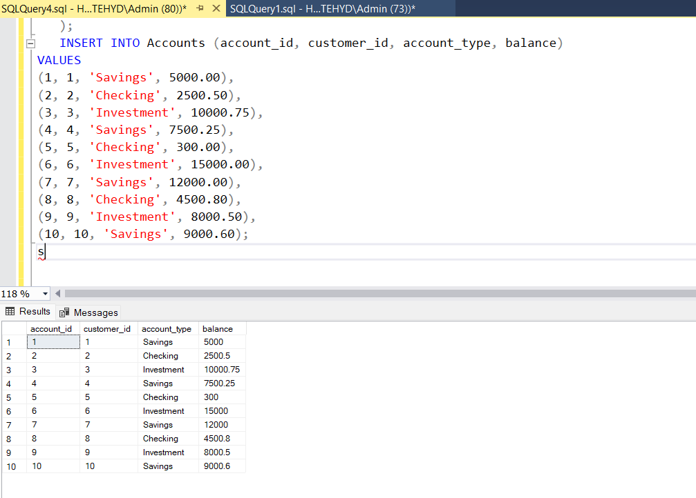
   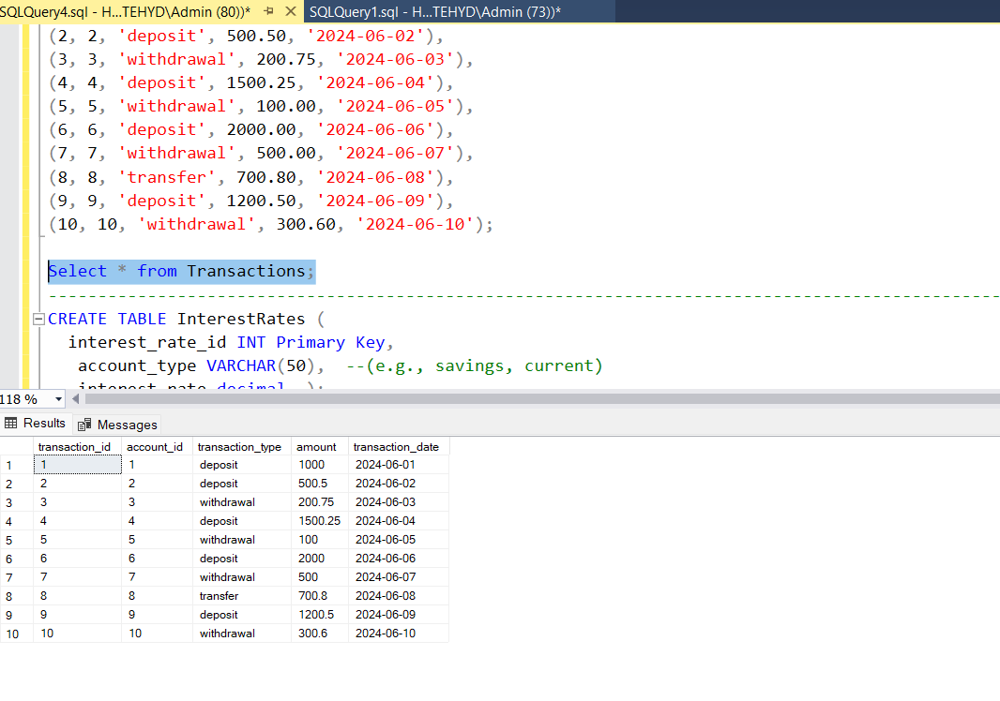
   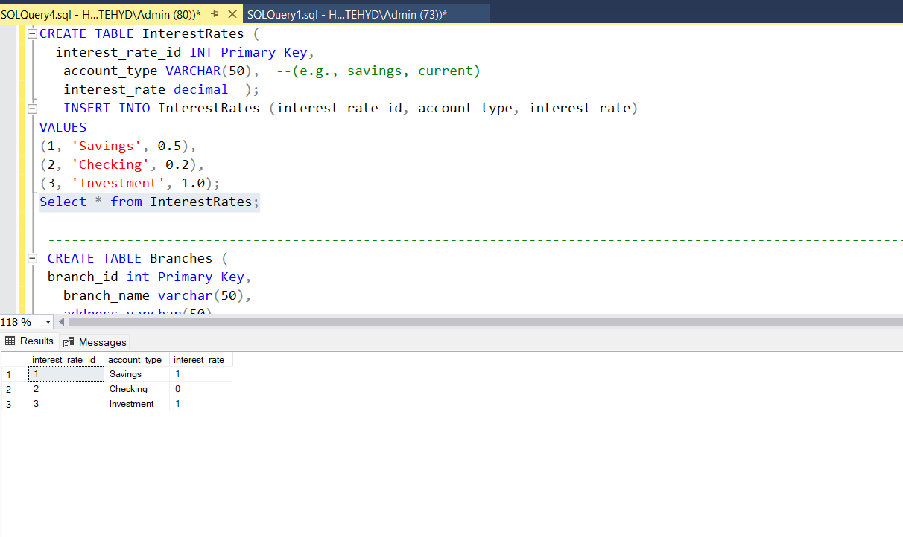
   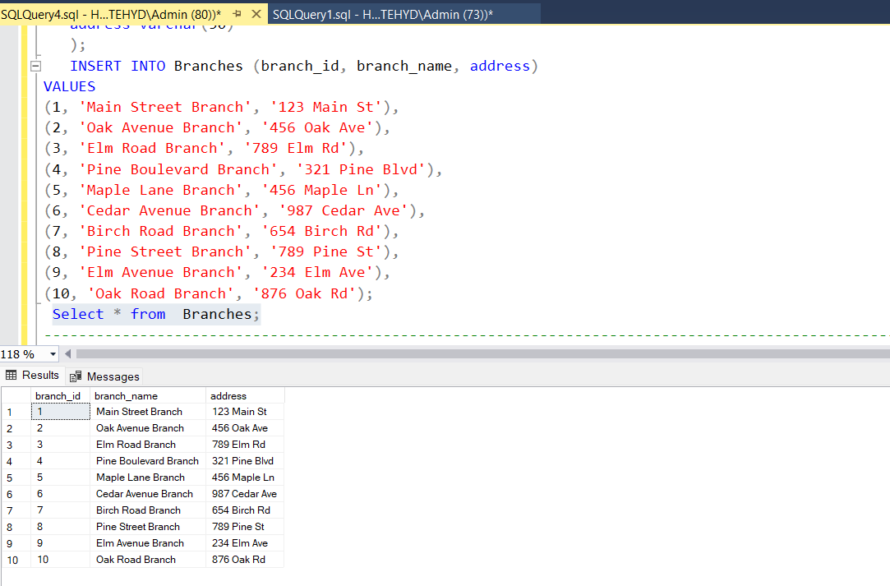

```sql
2. Write a SQL query to retrieve the name, account type, and email of all customers.
Select customer_id, first_name, last_name,CONCAT(first_name , last_name)  as Name from Customers_1
 inner join Accounts on Accounts.customer_id=Customers_1.customer_id;
```


```sql
3. Write a SQL query to list all transactions along with the corresponding customer.
Select T.transaction_id,CONCAT(C.first_name, C.last_name)  as Name from CUSTOMERS C
JOIN ACCOUNTS A ON C.Customer_id = A.Customer_id
JOIN Transactions T ON A.account_id = T.account_id
order by Name;
```


```sql
4. Write a SQL query to increase the balance of a specific account by a certain amount.
Update Accounts set balance = balance + 5000.00
where account_id=4;
Select account_id, balance from Accounts where account_id=4;
```

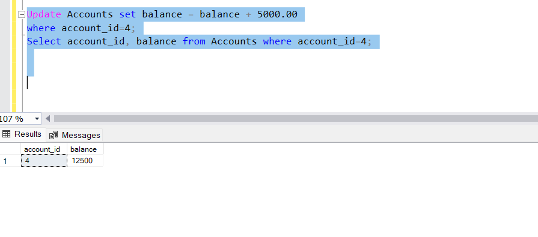

```sql
5. Write a SQL query to combine the first and last names of customers as `full_name`.
Select customer_id, first_name, last_name,CONCAT(first_name , last_name)  as full_name from Customers_1;
```

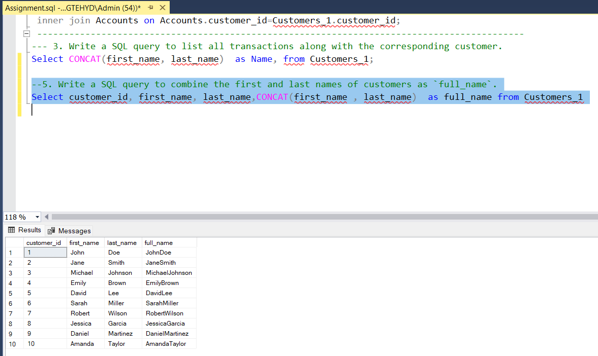

```sql
6. Write a SQL query to remove accounts with a balance of zero where the account type is savings.
Select account_type , Balance from Accounts
where account_type='savings' AND balance='0';
```

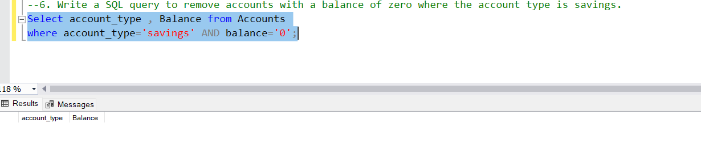

```sql
7. Write a SQL query to find customers living in a specific city.
 UPDATE Customers_1 SET address = '456 Oak Ave'
 where customer_id = 5;
   Select * from Customers_1;
    Select Customer_id ,CONCAT(first_name , last_name)  as full_name , address from Customers_1
	where address='456 Oak Ave';
```


```sql
8. Write a SQL query to get the account balance for a specific account.
Select * from Accounts where account_id=4;
```

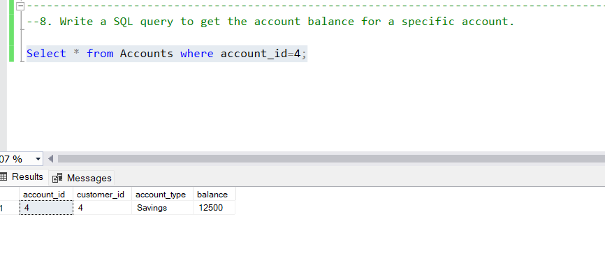

```sql
9. Write a SQL query to calculate the interest accrued on savings accounts based on a given interest rate.
Select Accounts.customer_id , avg( balance) as average  from Accounts
inner join  Customers on Customers.customer_id=Accounts.customer_id
group  by Accounts.customer_id;

```


```sql
10. Write a SQL query to find the average account balance for all customers.
Select Accounts.customer_id , avg(balance) as AverageBalance from Accounts
inner join  Customers on Customers.customer_id=Accounts.customer_id
group  by Accounts.customer_id;
```


```sql
11. Write a SQL query to calculate the average daily balance for each account over a specified period.


```

```sql
12. Identify accounts with the highest number of transactions ordered by descending order.

Select account_id,count(account_id) as count from Transactions group by account_id order by count(account_id) desc;
```

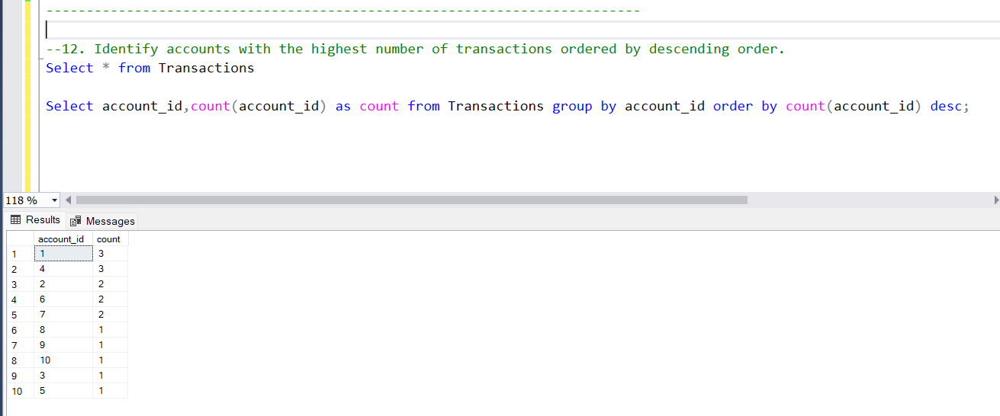

```sql
13. List customers with high aggregate account balances, along with their account types.
Select Customers.Customer_id ,CONCAT(Customers.first_name,Customers.last_name) AS FULLNAME,account_id ,account_type ,Sum(balance) as Balance from Accounts
inner join Customers on customers.customer_id=Accounts.customer_id
group by Customers.Customer_id,CONCAT(Customers.first_name,Customers.last_name), account_id,account_type order by SUM(balance) desc;
```

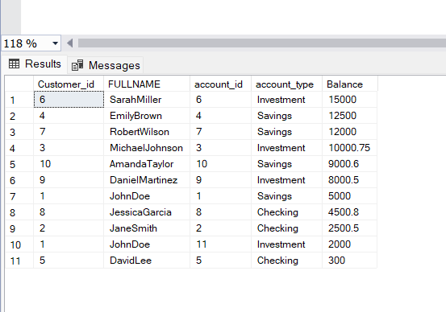

```sql
14. Identify and list duplicate transactions based on transaction amount, date, and account.
SELECT AMOUNT, transaction_date,Account_id,COUNT(*) FROM Transactions
GROUP BY AMOUNT, transaction_date,Account_id HAVING COUNT(*)>1;

```

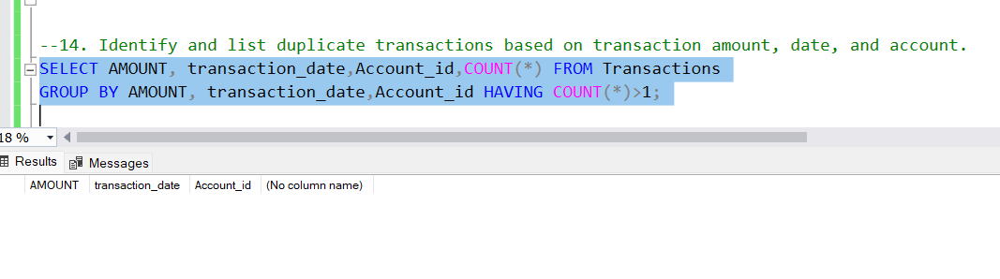

```sql
15. Calculate the total balance for each account type, including a subquery within the SELECT clause.
SELECT account_type,(SELECT SUM(balance) FROM Accounts
                   WHERE account_type = a.account_type) AS total_balance
                   FROM (SELECT DISTINCT account_type FROM Accounts) AS a;

```


